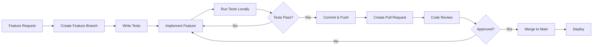

# ArtStore - Руководство по разработке

## Оглавление

1. [Начало работы](#начало-работы)
2. [Методология разработки](#методология-разработки)
3. [Окружения](#окружения)
4. [API документация](#api-документация)
5. [Configuration Parameters Convention](#configuration-parameters-convention)
6. [Тестирование](#тестирование)
7. [Docker Best Practices](#docker-best-practices)
8. [Git Workflow](#git-workflow)
9. [Code Review Guidelines](#code-review-guidelines)

## Начало работы

### Требования

- **Python** >= 3.12
- **Docker** >= 20.10, **Docker Compose** >= 2.0 (для локального окружения)
- **kubectl** + **helm** (для работы с K8s окружением)
- **Node.js** >= 18 (для Admin UI)
- **Git**

### Первоначальная настройка

```bash
# 1. Клонировать репозиторий
git clone <repository-url>
cd artStore

# 2. Создать ЕДИНЫЙ виртуальное окружение Python
python3 -m venv .venv
source .venv/bin/activate  # Linux/macOS

# 3. Установить зависимости для всех Python модулей
pip install -r admin-module/requirements.txt
pip install -r storage-element/requirements.txt
pip install -r ingester-module/requirements.txt
pip install -r query-module/requirements.txt
```

## Методология разработки

### Принципы

1. **Trunk-Based Development**: Короткоживущие feature branches с частыми merge в main
2. **Test-Driven Development (TDD)**: Тесты пишутся перед кодом
3. **Continuous Integration**: Автоматический запуск тестов на каждый commit
4. **Infrastructure as Code**: Инфраструктура описана в Docker Compose (локально) и Helm Charts (K8s)

### Рабочий процесс



### Этапы разработки feature

1. **Planning**: Уточнение требований, проектирование API
2. **Implementation**: TDD подход (test → code → refactor)
3. **Testing**: Unit → Integration → E2E (если нужно)
4. **Documentation**: Обновление README модуля
5. **Review**: Code review с минимум одним reviewer
6. **Deployment**: Deploy после merge

## Окружения

Проект поддерживает два окружения для разработки. Инструкции по запуску и настройке находятся в отдельных документах:

| Окружение | Описание | Документация |
| --------- | -------- | ------------ |
| **Docker Compose** | Локальная разработка, всё на одной машине | [README.md → Быстрый старт](README.md#быстрый-старт) |
| **Kubernetes** | Dev/staging кластер, Helm Charts, Harbor | [k8s/README.md](k8s/README.md) |

### 🔴 Docker Compose: работать только из корня проекта

```bash
# ✅ ПРАВИЛЬНО
cd <project-root>
docker-compose up -d

# ❌ НЕПРАВИЛЬНО — не запускать из поддиректорий модулей
cd admin-module
docker-compose up -d  # НЕ ДЕЛАТЬ ТАК!
```

### 🔴 Пересборка при изменении Python кода

При изменении Python файлов **обязательно** пересобирать без кеша:

```bash
# ✅ ПРАВИЛЬНО — пересборка БЕЗ КЕША
docker-compose build --no-cache <module-name>
docker-compose up -d <module-name>

# Альтернатива
docker-compose up -d --build --force-recreate <module-name>
```

**Причина**: Docker кеширует слои образа. Если изменения только в Python файлах, Docker может использовать кешированный слой и НЕ скопировать обновлённый код.

## API документация

Для получения списка endpoints API модулей в первую очередь обращайтесь к **Swagger** запущенного модуля. Swagger обычно включён (`APP_SWAGGER_ENABLED=on`).

**Через K8s Gateway** (`artstore.kryukov.lan`):

| Модуль | Swagger URL |
| ------ | ----------- |
| Admin Module | `http://artstore.kryukov.lan/api/docs` |
| Ingester Module | `http://artstore.kryukov.lan/api/upload/docs` |
| Query Module | `http://artstore.kryukov.lan/api/search/docs` |

**Через Docker Compose** (localhost):

| Модуль | Swagger URL |
| ------ | ----------- |
| Admin Module | `http://localhost:8000/docs` |
| Ingester Module | `http://localhost:8020/docs` |
| Query Module | `http://localhost:8030/docs` |
| Storage Element | `http://localhost:8010/docs` |

> В K8s Storage Elements не имеют HTTPRoute — доступ к Swagger только через `kubectl port-forward`.

## Configuration Parameters Convention

### Унифицированные параметры

Все модули используют единую конвенцию именования. **Перед добавлением нового параметра проверь существующие!**

| Категория | Параметры | Модули |
|-----------|-----------|--------|
| Database | `DB_HOST`, `DB_PORT`, `DB_USERNAME`, `DB_PASSWORD`, `DB_DATABASE` | admin, storage, query |
| Database Pool | `DB_POOL_SIZE`, `DB_MAX_OVERFLOW`, `DB_ECHO` | admin, storage, query |
| Database SSL | `DB_SSL_ENABLED`, `DB_SSL_MODE`, `DB_SSL_CA_CERT` | все с БД |
| Swagger | `APP_SWAGGER_ENABLED` | все |
| Logging | `LOG_LEVEL`, `LOG_FORMAT` | все |
| Redis | `REDIS_HOST`, `REDIS_PORT`, `REDIS_DB`, `REDIS_PASSWORD` | все |
| Storage | `STORAGE_MAX_SIZE` (в байтах) | storage-element |

### Redis DB Allocation

| DB | Модули | Назначение |
|----|--------|------------|
| 0 | Admin, Storage, Ingester | Service Discovery, Pub/Sub |
| 1 | Query | Кеширование (изолировано) |

### Boolean параметры

Используй формат `on`/`off`:
```bash
APP_DEBUG=on
APP_SWAGGER_ENABLED=off
DB_SSL_ENABLED=on
```

### Добавление нового параметра

1. **Проверь существующие** — найди аналогичные во всех модулях
2. **Переиспользуй** — используй существующее имя и формат
3. **Документируй** — обнови `.env.example` и README.md
4. **Унифицируй** — параметр должен иметь одинаковое имя во всех модулях

### Логирование

**Production**: `LOG_FORMAT=json` (обязательно), **Development**: `LOG_FORMAT=text` (допускается)

## Тестирование

### Философия тестирования

**Пирамида тестирования**:
```
     /\
    /E2E\         ← Мало (критические сценарии)
   /------\
  /Integr-\      ← Средне (API endpoints, межмодульное взаимодействие)
 /--------\
/---Unit---\    ← Много (бизнес-логика, утилиты)
```

### Unit Tests

**Цель**: Тестирование изолированных функций и классов

**Запуск**:
```bash
# Активация venv (из корня проекта!)
source .venv/bin/activate

# Тестирование конкретного модуля
pytest admin-module/tests/unit/ -v
pytest storage-element/tests/unit/ -v --cov=app

# С coverage report
pytest admin-module/tests/ --cov=app --cov-report=html

# Docker-based тестирование (рекомендуется для CI)
docker-compose run --rm admin-module pytest tests/unit/ -v
```

**Best Practices**:
- Мокировать external dependencies (PostgreSQL, Redis, HTTP clients)
- Использовать pytest fixtures для setup/teardown
- Один assert на тест (в идеале)
- Имена тестов описывают behavior: `test_upload_file_validates_size_limit`

### Integration Tests

**Цель**: Тестирование API endpoints и интеграций

**Запуск**:
```bash
# С реальными зависимостями (PostgreSQL, Redis в Docker)
pytest admin-module/tests/integration/ -v

# Docker-based (изолированная среда)
docker-compose -f docker-compose.test.yml up --abort-on-container-exit admin-module-test
```

**Best Practices**:
- Использовать test database (отдельную от dev)
- Cleanup после каждого теста (fixtures с yield)
- Тестировать полные HTTP request/response циклы
- Проверять side effects (database changes, file creation)

### E2E Tests (опционально)

**Цель**: Тестирование критических пользовательских сценариев

**Инструменты**: Playwright, Cypress (для Admin UI)

```bash
cd admin-ui
npm run e2e            # запуск
npm run e2e:open       # интерактивный режим
```

### Test Coverage Requirements

**Минимальные требования**:
- **Unit tests**: ≥ 80% coverage для production code
- **Integration tests**: Все API endpoints покрыты
- **E2E tests**: Критические user flows (login, upload, search, download)

```bash
pytest tests/ --cov=app --cov-report=term-missing --cov-fail-under=80
```

## Docker Best Practices

### Multi-Stage Builds

Все модули используют multi-stage Dockerfile для оптимизации размера:

```dockerfile
# Stage 1: Builder
FROM python:3.12-slim as builder
WORKDIR /app
COPY requirements.txt .
RUN pip install --no-cache-dir -r requirements.txt

# Stage 2: Runtime
FROM python:3.12-slim
WORKDIR /app
COPY --from=builder /usr/local/lib/python3.12/site-packages /usr/local/lib/python3.12/site-packages
COPY app/ /app/
CMD ["uvicorn", "app.main:app", "--host", "0.0.0.0", "--port", "8000"]
```

### Volume Management

**Принципы**:
1. **НЕ монтировать** директории с исходным кодом для записи debug файлов
2. **Использовать именованные volumes** для данных приложения
3. **Использовать tmpfs** для временных файлов

```yaml
services:
  storage-element:
    build: ./storage-element
    volumes:
      # ✅ Именованный volume для данных
      - storage-data:/app/.data/storage
      # ✅ tmpfs для временных файлов
      - type: tmpfs
        target: /tmp
      # ❌ НЕ монтировать source code для записи
      # - ./storage-element:/app  # НЕПРАВИЛЬНО!

volumes:
  storage-data:
    driver: local
```

### Testing Isolation

**Требование**: Тесты НЕ должны создавать файлы в директориях с исходным кодом

```yaml
# docker-compose.test.yml
services:
  storage-element-test:
    build:
      context: ./storage-element
      target: test
    volumes:
      - test-storage:/app/.data/storage
      - test-logs:/app/logs
      - type: tmpfs
        target: /app/.pytest_cache
```

**pytest.ini конфигурация**:
```ini
[pytest]
cache_dir = /tmp/pytest_cache

[coverage:run]
data_file = /tmp/.coverage
```

## Git Workflow

### Branch Naming

```
feature/  - Новые features
bugfix/   - Исправления bugs
hotfix/   - Критические production fixes
docs/     - Документация
refactor/ - Рефакторинг без изменения функционала
test/     - Добавление/улучшение тестов
```

**Примеры**:
```
feature/admin-auth-oauth2
bugfix/storage-element-wal-race-condition
docs/update-readme-project-modules
```

### Commit Messages (Conventional Commits)

**Format**: `<type>(<scope>): <subject>`

**Types**:
- `feat`: Новая функциональность
- `fix`: Исправление бага
- `docs`: Документация
- `style`: Форматирование (не влияет на код)
- `refactor`: Рефакторинг
- `test`: Добавление/изменение тестов
- `chore`: Maintenance задачи

**Примеры**:
```bash
git commit -m "feat(admin-module): Add OAuth 2.0 Client Credentials authentication"
git commit -m "fix(storage-element): Fix WAL race condition during concurrent uploads"
git commit -m "docs(readme): Update README-PROJECT.md for all modules"
git commit -m "test(ingester): Add integration tests for batch upload"
```

### Pull Request Process

1. **Create PR** с описанием изменений и ссылкой на issue
2. **Self-review**: Проверить diff перед запросом review
3. **Tests**: Убедиться что все тесты проходят
4. **Code Review**: Минимум 1 reviewer approval
5. **Merge**: Squash and merge (для clean history)

### PR Template

```markdown
## Description
Кратко описание изменений

## Related Issue
Closes #123

## Type of Change
- [ ] Bug fix
- [ ] New feature
- [ ] Breaking change
- [ ] Documentation update

## Testing
- [ ] Unit tests added/updated
- [ ] Integration tests added/updated
- [ ] Manual testing performed

## Checklist
- [ ] Code follows style guidelines
- [ ] Self-review performed
- [ ] Comments added for complex logic
- [ ] Documentation updated
- [ ] No console.log/debug prints left
```

## Code Review Guidelines

### Что проверять

**Функциональность**:
- Код решает заявленную проблему
- Нет регрессий в существующей функциональности
- Edge cases обработаны

**Качество кода**:
- Соответствие PEP 8 (Python) / Angular Style Guide
- Нет дублирования кода (DRY principle)
- Функции/методы короткие и focused (Single Responsibility)
- Meaningful имена переменных и функций

**Безопасность**:
- Нет SQL injection уязвимостей
- Input validation присутствует
- Sensitive data не логируется
- JWT tokens валидируются правильно

**Performance**:
- Нет N+1 query проблем
- Индексы БД используются эффективно
- Нет memory leaks (особенно в async code)

**Тестирование**:
- Все новые функции покрыты тестами
- Тесты проходят
- Coverage не упал

### Комментарии reviewer

**Используйте категории**:
- `[nit]` - Незначительное замечание (необязательно исправлять)
- `[question]` - Вопрос для обсуждения
- `[blocker]` - Критично, требует исправления перед merge
- `[suggestion]` - Предложение улучшения

**Примеры**:
```
[blocker] Missing input validation here could lead to SQL injection
[suggestion] Consider extracting this logic into a separate function for reusability
[nit] Typo in comment: "recieve" → "receive"
[question] Why did you choose X approach instead of Y?
```

## Troubleshooting

**Проблема**: `docker-compose` команды не находят сервисы
**Решение**: Всегда запускайте из корня проекта

**Проблема**: JWT 401 Unauthorized при inter-service вызовах
**Решение**: Пересоздать JWT ключи — `./k8s/scripts/generate-jwt-keys.sh --force`, перезапустить все модули. Подробнее: [k8s/README.md](k8s/README.md)

**Проблема**: Ingester не видит Storage Elements
**Решение**: SE требуют ручной регистрации через admin-module API (SUPER_ADMIN). Подробнее: [k8s/README.md](k8s/README.md)

**Проблема**: Tests fail с "database already exists"
**Решение**: Используйте отдельную test database или cleanup fixtures

**Проблема**: Coverage report не генерируется
**Решение**: Установите `pytest-cov`: `pip install pytest-cov`

## Дополнительные ресурсы

- [Главная документация проекта](README.md)
- [Kubernetes окружение](k8s/README.md)
- [Admin Module](admin-module/README.md)
- [Storage Element](storage-element/README.md)
- [Ingester Module](ingester-module/README.md)
- [Query Module](query-module/README.md)
- [Admin UI](admin-ui/README.md)
- [Мониторинг](monitoring/README.md)

## FAQ

**Q: Нужно ли создавать virtual environment для каждого модуля?**
A: Нет! Используйте ЕДИНЫЙ `.venv` в корне проекта для всех Python модулей.

**Q: Можно ли использовать локальный Python для разработки без Docker?**
A: Да, для разработки можно, но **тестирование ОБЯЗАТЕЛЬНО** в Docker окружении.

**Q: Как добавить новый Python package?**
A: Добавьте в `<module>/requirements.txt` и пересоберите Docker образ: `docker-compose build <module>`

**Q: Где найти инструкции по запуску инфраструктуры?**
A: Docker Compose — [README.md](README.md), Kubernetes — [k8s/README.md](k8s/README.md)

**Q: Как посмотреть API endpoints модуля?**
A: Через Swagger запущенного модуля (`/docs`). Swagger обычно включён. См. раздел [API документация](#api-документация).
