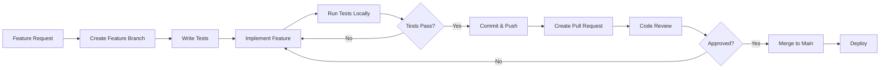

# ArtStore - Руководство по разработке и тестированию

## Оглавление
1. [Начало работы](#начало-работы)
2. [Методология разработки](#методология-разработки)
3. [Инфраструктура и запуск](#инфраструктура-и-запуск)
4. [Тестирование](#тестирование)
5. [Docker Best Practices](#docker-best-practices)
6. [Git Workflow](#git-workflow)
7. [Code Review Guidelines](#code-review-guidelines)

## Начало работы

### Требования

- **Docker** >= 20.10
- **Docker Compose** >= 2.0
- **Python** >= 3.12
- **Node.js** >= 18 (для Admin UI)
- **Git**

### Первоначальная настройка

```bash
# 1. Клонировать репозиторий
git clone <repository-url>
cd artStore

# 2. Создать ЕДИНЫЙ виртуальное окружение Python
python3 -m venv .venv
source .venv/bin/activate  # Linux/macOS

# 3. Установить зависимости для всех Python модулей
pip install -r admin-module/requirements.txt
pip install -r storage-element/requirements.txt
pip install -r ingester-module/requirements.txt
pip install -r query-module/requirements.txt

# 4. Запустить базовую инфраструктуру
docker-compose up -d

# 5. Проверить доступность сервисов
docker-compose ps
```

## Методология разработки

### Принципы

1. **Trunk-Based Development**: Короткоживущие feature branches с частыми merge в main
2. **Test-Driven Development (TDD)**: Тесты пишутся перед кодом
3. **Continuous Integration**: Автоматический запуск тестов на каждый commit
4. **Infrastructure as Code**: Вся инфраструктура описана в Docker Compose файлах

### Рабочий процесс



### Этапы разработки feature

1. **Planning**: Уточнение требований, проектирование API
2. **Implementation**: TDD подход (test → code → refactor)
3. **Testing**: Unit → Integration → E2E (если нужно)
4. **Documentation**: Обновление README-PROJECT.md модуля
5. **Review**: Code review с минимум одним reviewer
6. **Deployment**: Автоматический deploy после merge

## Инфраструктура и запуск

### 🔴 КРИТИЧЕСКИ ВАЖНО: Docker Compose в корне проекта

**ОБЯЗАТЕЛЬНОЕ ПРАВИЛО**: Использовать ТОЛЬКО docker-compose файлы из корня проекта!

```bash
# ✅ ПРАВИЛЬНО - всегда из корня проекта
cd /home/artur/Projects/artStore
docker-compose up -d

# ❌ НЕПРАВИЛЬНО - не запускать из поддиректорий модулей
cd admin-module
docker-compose up -d  # НЕ ДЕЛАТЬ ТАК!
```

### Запуск окружений

#### Базовая инфраструктура (PostgreSQL, Redis, MinIO)

```bash
docker-compose up -d postgres redis minio pgadmin
```

#### Запуск всех модулей

```bash
# Запуск всех backend модулей
docker-compose up -d admin-module storage-element ingester-module query-module

# Запуск с логами
docker-compose up admin-module storage-element ingester-module query-module

# Просмотр логов конкретного модуля
docker-compose logs -f ingester-module
```

#### Мониторинг стек (Prometheus, Grafana)

```bash
docker-compose -f docker-compose.monitoring.yml up -d

# Доступ:
# Prometheus: http://localhost:9090
# Grafana: http://localhost:3000 (admin/admin123)
# AlertManager: http://localhost:9093
```

### Остановка и очистка

```bash
# Остановка всех сервисов
docker-compose down

# Остановка с удалением volumes (ОСТОРОЖНО: удалит все данные!)
docker-compose down -v

# Пересборка после изменений
docker-compose build <module-name>
docker-compose up -d <module-name>
```

## Тестирование

### Философия тестирования

**Пирамида тестирования**:
```
     /\
    /E2E\         ← Мало (критические сценарии)
   /------\
  /Integr-\      ← Средне (API endpoints, межмодульное взаимодействие)
 /--------\
/---Unit---\    ← Много (бизнес-логика, утилиты)
```

### Unit Tests

**Цель**: Тестирование изолированных функций и классов

**Запуск**:
```bash
# Активация venv (из корня проекта!)
source .venv/bin/activate

# Тестирование конкретного модуля
pytest admin-module/tests/unit/ -v
pytest storage-element/tests/unit/ -v --cov=app

# С coverage report
pytest admin-module/tests/ --cov=app --cov-report=html
# Откройте htmlcov/index.html для просмотра

# Docker-based тестирование (рекомендуется для CI)
docker-compose run --rm admin-module pytest tests/unit/ -v
```

**Best Practices**:
- Мокировать external dependencies (PostgreSQL, Redis, HTTP clients)
- Использовать pytest fixtures для setup/teardown
- Один assert на тест (в идеале)
- Имена тестов описывают behavior: `test_upload_file_validates_size_limit`

### Integration Tests

**Цель**: Тестирование API endpoints и интеграций

**Запуск**:
```bash
# С реальными зависимостями (PostgreSQL, Redis в Docker)
pytest admin-module/tests/integration/ -v

# Docker-based (изолированная среда)
docker-compose -f docker-compose.test.yml up --abort-on-container-exit admin-module-test
```

**Best Practices**:
- Использовать test database (отдельную от dev)
- Cleanup после каждого теста (fixtures с yield)
- Тестировать полные HTTP request/response циклы
- Проверять side effects (database changes, file creation)

### E2E Tests (опционально)

**Цель**: Тестирование критических пользовательских сценариев

**Инструменты**: Playwright, Cypress (для Admin UI)

**Запуск**:
```bash
# Playwright для backend E2E
cd admin-ui
npm run e2e

# Интерактивный режим
npm run e2e:open
```

### Test Coverage Requirements

**Минимальные требования**:
- **Unit tests**: ≥ 80% coverage для production code
- **Integration tests**: Все API endpoints покрыты
- **E2E tests**: Критические user flows (login, upload, search, download)

**Проверка coverage**:
```bash
pytest tests/ --cov=app --cov-report=term-missing --cov-fail-under=80
```

## Docker Best Practices

### Multi-Stage Builds

Все модули используют multi-stage Dockerfile для оптимизации размера:

```dockerfile
# Stage 1: Builder
FROM python:3.12-slim as builder
WORKDIR /app
COPY requirements.txt .
RUN pip install --no-cache-dir -r requirements.txt

# Stage 2: Runtime
FROM python:3.12-slim
WORKDIR /app
COPY --from=builder /usr/local/lib/python3.12/site-packages /usr/local/lib/python3.12/site-packages
COPY app/ /app/
CMD ["uvicorn", "app.main:app", "--host", "0.0.0.0", "--port", "8000"]
```

### Volume Management

**Принципы**:
1. **НЕ монтировать** директории с исходным кодом для записи debug файлов
2. **Использовать именованные volumes** для данных приложения
3. **Использовать tmpfs** для временных файлов

**Правильная конфигурация**:
```yaml
services:
  storage-element:
    build: ./storage-element
    volumes:
      # ✅ Именованный volume для данных
      - storage-data:/app/.data/storage

      # ✅ tmpfs для временных файлов
      - type: tmpfs
        target: /tmp

      # ❌ НЕ монтировать source code для записи
      # - ./storage-element:/app  # НЕПРАВИЛЬНО!

volumes:
  storage-data:
    driver: local
```

### Testing Isolation

**Требование**: Тесты НЕ должны создавать файлы в директориях с исходным кодом

**Решение**:
```yaml
# docker-compose.test.yml
services:
  storage-element-test:
    build:
      context: ./storage-element
      target: test  # Отдельный stage для тестов
    volumes:
      # ✅ Изолированные volumes для test data
      - test-storage:/app/.data/storage
      - test-logs:/app/logs

      # ✅ tmpfs для pytest cache
      - type: tmpfs
        target: /app/.pytest_cache

volumes:
  test-storage:
  test-logs:
```

**pytest.ini конфигурация**:
```ini
[pytest]
# Кеш в /tmp вместо .pytest_cache
cache_dir = /tmp/pytest_cache

# Coverage data в /tmp
[coverage:run]
data_file = /tmp/.coverage
```

### Логирование

**Production** (docker-compose.yml):
```yaml
environment:
  LOG_LEVEL: INFO
  LOG_FORMAT: json  # ОБЯЗАТЕЛЬНО для production
  LOG_FILE: /app/logs/app.log  # В volume, НЕ в source directory
```

**Development** (docker-compose.dev.yml):
```yaml
environment:
  LOG_LEVEL: DEBUG
  LOG_FORMAT: text  # Разрешен только в development
```

## Git Workflow

### Branch Naming

```
feature/  - Новые features
bugfix/   - Исправления bugs
hotfix/   - Критические production fixes
docs/     - Документация
refactor/ - Рефакторинг без изменения функционала
test/     - Добавление/улучшение тестов
```

**Примеры**:
```
feature/admin-auth-oauth2
bugfix/storage-element-wal-race-condition
docs/update-readme-project-modules
```

### Commit Messages (Conventional Commits)

**Format**: `<type>(<scope>): <subject>`

**Types**:
- `feat`: Новая функциональность
- `fix`: Исправление бага
- `docs`: Документация
- `style`: Форматирование (не влияет на код)
- `refactor`: Рефакторинг
- `test`: Добавление/изменение тестов
- `chore`: Maintenance задачи

**Примеры**:
```bash
git commit -m "feat(admin-module): Add OAuth 2.0 Client Credentials authentication"
git commit -m "fix(storage-element): Fix WAL race condition during concurrent uploads"
git commit -m "docs(readme): Update README-PROJECT.md for all modules"
git commit -m "test(ingester): Add integration tests for batch upload"
```

### Pull Request Process

1. **Create PR** с описанием изменений и ссылкой на issue
2. **Self-review**: Проверить diff перед запросом review
3. **Tests**: Убедиться что все тесты проходят
4. **Code Review**: Минимум 1 reviewer approval
5. **Merge**: Squash and merge (для clean history)

### PR Template

```markdown
## Description
Кратко описание изменений

## Related Issue
Closes #123

## Type of Change
- [ ] Bug fix
- [ ] New feature
- [ ] Breaking change
- [ ] Documentation update

## Testing
- [ ] Unit tests added/updated
- [ ] Integration tests added/updated
- [ ] Manual testing performed

## Checklist
- [ ] Code follows style guidelines
- [ ] Self-review performed
- [ ] Comments added for complex logic
- [ ] Documentation updated
- [ ] No console.log/debug prints left
```

## Code Review Guidelines

### Что проверять

**Функциональность**:
- Код решает заявленную проблему
- Нет регрессий в существующей функциональности
- Edge cases обработаны

**Качество кода**:
- Соответствие PEP 8 (Python) / Angular Style Guide
- Нет дублирования кода (DRY principle)
- Функции/методы короткие и focused (Single Responsibility)
- Meaningful имена переменных и функций

**Безопасность**:
- Нет SQL injection уязвимостей
- Input validation присутствует
- Sensitive data не логируется
- JWT tokens валидируются правильно

**Performance**:
- Нет N+1 query проблем
- Индексы БД используются эффективно
- Нет memory leaks (особенно в async code)

**Тестирование**:
- Все новые функции покрыты тестами
- Тесты проходят
- Coverage не упал

### Комментарии reviewer

**Используйте категории**:
- `[nit]` - Незначительное замечание (необязательно исправлять)
- `[question]` - Вопрос для обсуждения
- `[blocker]` - Критично, требует исправления перед merge
- `[suggestion]` - Предложение улучшения

**Примеры**:
```
[blocker] Missing input validation here could lead to SQL injection
[suggestion] Consider extracting this logic into a separate function for reusability
[nit] Typo in comment: "recieve" → "receive"
[question] Why did you choose X approach instead of Y?
```

## Troubleshooting

### Общие проблемы

**Проблема**: `docker-compose` команды не находят сервисы
**Решение**: Всегда запускайте из корня проекта (`/home/artur/Projects/artStore`)

**Проблема**: PostgreSQL connection timeout
**Решение**: Убедитесь что PostgreSQL контейнер запущен и healthy (`docker-compose ps`)

**Проблема**: Tests fail с "database already exists"
**Решение**: Используйте отдельную test database или cleanup fixtures

**Проблема**: Coverage report не генерируется
**Решение**: Установите `pytest-cov`: `pip install pytest-cov`

### Полезные команды

```bash
# Проверить здоровье всех контейнеров
docker-compose ps

# Перезапустить конкретный сервис
docker-compose restart admin-module

# Посмотреть последние логи
docker-compose logs --tail=100 -f storage-element

# Очистить все Docker ресурсы (ОСТОРОЖНО!)
docker system prune -a --volumes

# Подключиться к PostgreSQL
docker exec -it artstore_postgres psql -U artstore -d artstore

# Подключиться к Redis
docker exec -it artstore_redis redis-cli
```

## Дополнительные ресурсы

- [Главная документация проекта](README.md)
- [Admin Module](admin-module/README.md)
- [Storage Element](storage-element/README.md)
- [Ingester Module](ingester-module/README.md)
- [Query Module](query-module/README.md)
- [Admin UI](admin-ui/README.md)
- [Мониторинг](monitoring/README.md)

## FAQ

**Q: Нужно ли создавать virtual environment для каждого модуля?**
A: Нет! Используйте ЕДИНЫЙ `.venv` в корне проекта для всех Python модулей.

**Q: Где запускать docker-compose команды?**
A: **ВСЕГДА** из корня проекта (`/home/artur/Projects/artStore`), никогда из поддиректорий модулей.

**Q: Как запустить только один модуль для тестирования?**
A: `docker-compose up -d postgres redis minio <module-name>`

**Q: Можно ли использовать локальный Python для разработки без Docker?**
A: Да, для разработки можно, но **тестирование ОБЯЗАТЕЛЬНО** в Docker окружении.

**Q: Как добавить новый Python package?**
A: Добавьте в `<module>/requirements.txt` и пересоберите Docker образ: `docker-compose build <module>`
