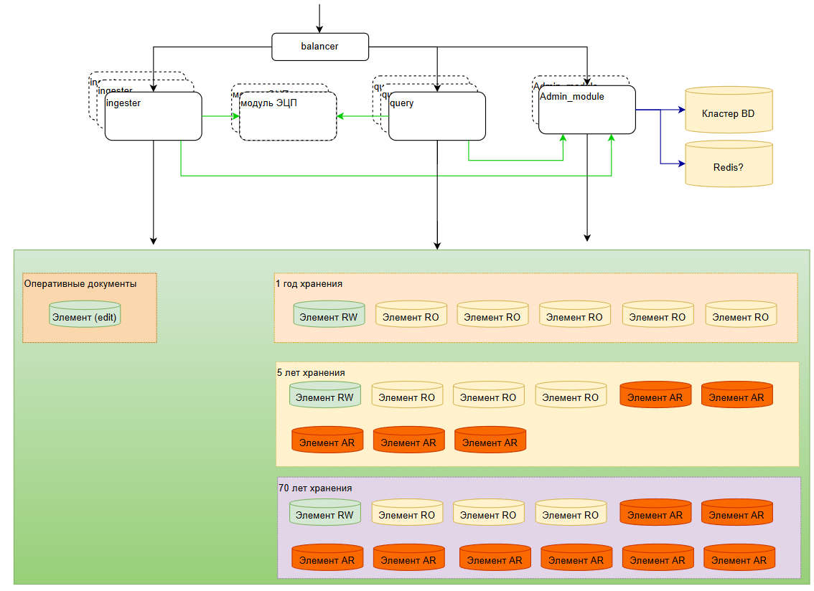

# Распределенное файловое хранилище

## Требования к хранилищу

### Разделение на части физического хранилища

Физическое хранилище данных должно быть разделено на части, удобные с точки зрения резервного копирования, восстановления, миграции и управления данными.

Физическое хранение данных не должно ограничиваться одним ЦОД.

### Быстрое восстановление после сбоев

В случае нештатной ситуации или восстановления после сбоев, система должна начать работу в кратчайший срок на минимальном наборе хранимых данных. С возможностью добавления данных из резервных копий без прерывания работы системы.

### Отказоустойчивость приложения

Приложения, реализующие хранилище должны быть отказоустойчивы.

Необходимо использовать горизонтальное масштабирование всех микросервисов.

Приложение должный быть stateless.

Использовать кеш. Например Redis.

### Однозначность данных и атрибутов (главный источник данных)

Система должна предусматривать хранение данных и их атрибутов в одном месте, что бы не возникало ситуаций когда хранимые данные не соответствуют их атрибутам и наоборот.

### Горячее | холодное хранение данных

Система должна предоставлять возможность переноса данных на хранение на съемные носители. Сохраняя быстрый доступ к атрибутам данных и возможность предоставления данных по запросу пользователей.

### Режим только для чтения

Система должна уметь переводить часть хранимых данных в режим только для чтения. Без возможности удаления или изменения данных.

### Предельный срок хранения данных

Система должна поддерживать атрибут "срок хранения" документов. И возможность автоматического или ручного удаления устаревших
документов.

### Версионность данных

Система должна поддерживать хранение различных версий одного
документа.

## Архитектура взаимодействия

### Аутентификация и Авторизация

Для взаимодействия между сервисами используется аутентификация на основе **JWT-токенов**, подписанных по асимметричному алгоритму **RS256**.

1.  **Admin Module Cluster** выступает в роли распределенного центра аутентификации. Кластер генерирует JWT-токены, подписанные **приватным ключом**, с автоматическим переключением между узлами при сбоях.
2.  Все остальные модули (`ingester`, `query`, `storage-element`) получают **публичный ключ** и могут **локально** проверять подпись токена, без необходимости обращаться к `Admin Module Cluster` для валидации каждого запроса.

### Комплексная система безопасности

Система реализует многоуровневую защиту данных и коммуникаций:

#### Шифрование (Encryption)
- **TLS 1.3 для transit encryption**: Все сетевые соединения между модулями защищены современным протоколом TLS 1.3
- **Key Management**: Централизованное управление JWT ключами через Admin Module Cluster

#### Identity & Access Management (IAM)
- **Automated JWT Key Rotation**: Автоматическая ротация JWT ключей каждые 24 часа с плавным переходом без прерывания сервиса
- **OAuth 2.0 Client Credentials**: Machine-to-machine аутентификация через Service Accounts для API клиентов:
  ```yaml
  Service Account Model:
    - client_id: Уникальный UUID идентификатор
    - client_secret: Безопасный секрет (bcrypt hashed)
    - role: ADMIN | USER | AUDITOR | READONLY
    - rate_limit: Ограничение запросов (100 req/min по умолчанию)
    - status: ACTIVE | SUSPENDED | EXPIRED
  ```
- **Automated Secret Rotation**: Автоматическая ротация client secrets каждые 90 дней с уведомлениями
- **Fine-grained RBAC**: Детализированная ролевая модель с правами доступа на уровне отдельных ресурсов и операций
- **Resource-level Permissions**: Контроль доступа к конкретным файлам и storage-element на основе ролей Service Account
- **JWT Claims Structure**: Автоматическое включение claims (client_id, role, permissions, rate_limit) в JWT токен
- **Comprehensive Audit Logging**: Полное логирование всех операций доступа с tamper-proof хранением для соответствия требованиям безопасности

#### Защита API
- **JWT Token Validation**: Строгая валидация токенов с проверкой подписи, срока действия и claims

### Консистентность данных

Система обеспечивает строгую консистентность данных через следующие механизмы:

#### Distributed Transactions (Распределенные транзакции)
- **Saga Pattern**: Для долгосрочных операций с файлами, включающих множественные шаги (загрузка → валидация → индексация → публикация в Service Discovery)
- **Two-Phase Commit (2PC)**: Для критических операций изменения метаданных и смены режимов storage-element
- **Write-Ahead Log (WAL)**: Обеспечение атомарности операций записи файлов и их атрибутов

#### Conflict Resolution (Разрешение конфликтов)
- **Уникальность файлов**: Файлы хранятся с уникальными именами `{username}_{timestamp}_{uuid}_{original_name}` для предотвращения коллизий
- **Атомарная запись атрибутов**: WAL → Temporary attr.json → fsync → Atomic rename (максимум 4KB на файл)
- **Automatic Reconciliation**: Автоматические процедуры восстановления консистентности при обнаружении расхождений

**Примечание**: Активная репликация между Storage Elements **не реализуется**, поэтому Vector Clocks не используются. Фокус на упрощенной модели консистентности через WAL + Saga Pattern.

#### Гарантии порядка операций
- **Файлы атрибутов** (`*.attr.json`) записываются **первыми** как единственный источник истины
- **Кеш базы данных** обновляется **только после** успешной записи файла атрибутов
- **Service Discovery** уведомляется **после** завершения локальных изменений
- **Rollback процедуры** автоматически восстанавливают состояние при сбоях на любом этапе

### Service Discovery и Отказоустойчивость

Система полностью устраняет **Single Points of Failure** через комплексную архитектуру высокой доступности:

#### Redis High Availability Cluster
- **Redis Sentinel Cluster**: Автоматический мониторинг и failover Redis master узлов
- **Multi-Redis Configuration**: 3+ Sentinel узла для кворумных решений
- **Automatic Failover**: RTO < 30 секунд при переключении на standby Redis
- **Local Configuration Fallback**: Автоматический переход на локальную конфигурацию при полной недоступности Redis
- **Eventual Consistency**: Graceful degradation с последующей синхронизацией

#### Admin Module Cluster Architecture
- **Raft Consensus Protocol**: Распределенное лидерство с автоматическими выборами
- **Multi-Master Active-Active**: 3+ узла Admin Module с consistent hashing нагрузки
- **Graceful Failover**: RTO < 15 секунд при недоступности leader узла
- **Split-Brain Protection**: Кворумные решения предотвращают разделение кластера
- **Service Discovery Publishing**: Каждый узел способен публиковать конфигурацию storage-element

#### Client-Side Resilience
1.  Модули **Ingester** и **Query** подключаются к **multiple Redis Sentinel endpoints**
2.  **Circuit Breaker Pattern**: Автоматическое отключение недоступных узлов
3.  **Local Cache**: Кеширование последней известной конфигурации storage-element
4.  **Retry Logic**: Экспоненциальный backoff при временных сбоях
5.  **Health Checking**: Постоянный мониторинг доступности всех зависимостей

### Оптимизация производительности

Система реализует комплексную стратегию повышения производительности:

#### Multi-Level Caching Strategy
- **Application Cache**: Redis Cluster с partitioning для метаданных и результатов поиска
- **Local Cache**: In-memory кеширование на каждом узле для критических данных
- **Database Query Cache**: PostgreSQL query cache с intelligent invalidation
- **Cache Warming**: Предварительная загрузка популярных файлов на основе популярности и частоты доступа

#### Search Performance Optimization
- **PostgreSQL Full-Text Search**: Встроенные возможности поиска PostgreSQL с GIN индексами
- **Database Query Optimization**: Оптимизированные индексы на metadata колонках
- **Parallel Search**: Параллельные запросы к множественным storage-element
- **Search Results Caching**: Кеширование популярных поисковых запросов в Redis
- **Simple Auto-complete**: Предиктивный поиск на основе кешированных метаданных
 
#### File Access Optimization
- **Compression on-the-fly**: Brotli/GZIP сжатие для передачи файлов
- **Connection Pooling**: Persistent HTTP/2 connections для снижения latency
- **Bandwidth Optimization**: Adaptive bitrate для больших файлов

### Advanced Monitoring и Observability

Система реализует комплексную систему наблюдаемости для обеспечения высокой производительности и надежности:

#### Observability Stack
- **OpenTelemetry для distributed tracing**: Полное отслеживание запросов через все микросервисы с корреляцией trace ID
- **Custom Business Metrics**: Специализированные метрики производительности
  - File upload latency (время загрузки файлов по размерам и storage-element)
  - Search performance (время отклика поисковых запросов и качество результатов)
  - Storage utilization (использование дискового пространства и прогнозы заполнения)
  - Authentication performance (время валидации JWT токенов и частота ротации ключей)
- **Custom Business Metrics**: Специализированные метрики производительности
  - File upload latency (время загрузки файлов по размерам и storage-element)
  - Search performance (время отклика поисковых запросов и качество результатов)
  - Storage utilization (использование дискового пространства и прогнозы заполнения)
  - Authentication performance (время валидации JWT токенов и частота ротации ключей)
 
#### Third-party Analytics Integration
- **Prometheus metrics**: Экспорт метрик для интеграции с Grafana, DataDog, New Relic
- **Structured logging**: ELK Stack и другие log aggregation системы
- **OpenTelemetry traces**: APM системы и external monitoring platforms

## Компоненты системы



### Управляющий контур

Набор приложений для управления системой.

- **Load Balancer Cluster**: Кластер балансировщиков (HAProxy/Nginx) с keepalived для исключения SPOF. Принимает HTTP запросы и распределяет их между экземплярами всех модулей с учётом их состояния здоровья.
- **[Admin Module Cluster](admin-module/README.md)**: Кластер узлов управления с отказоустойчивостью. Реализует:
  - **Raft consensus** для leader election между экземплярами кластера
  - **Multi-master конфигурацию** с consistent hashing для распределения нагрузки
  - **Graceful failover** с минимальным RTO при недоступности основного узла
  - **Координацию распределенных транзакций** через Saga Orchestrator
  - **OAuth 2.0 authentication** с генерацией JWT-токенов для Service Accounts
  - Управление Service Accounts и правами доступа
  - Генерацию JWT-токенов с распределенной валидацией через публичный ключ
  - Управление конфигурацией `Элементов хранения`
  - Публикацию конфигурации в Service Discovery (Redis HA)
- **[Admin User Interface](admin-ui/README.md)**: Графический интерфейс для администраторов.
- **[Ingester Cluster](ingester-module/README.md)**: Кластер узлов для обработки запросов на добавление, изменение и перенос данных. Автоматическое масштабирование и отказоустойчивость через Redis Sentinel endpoints.
- **[Query Cluster](query-module/README.md)**: Кластер узлов для обработки запросов поиска и получения документов с PostgreSQL full-text search. Circuit breaker pattern, multi-level caching и оптимизированные индексы для высокой производительности.
- **Модуль ЭЦП**: Приложение для работы с ЭЦП (функционал реализуется в последнюю очередь).

### Элемент хранения

[Элемент хранения](storage_element/README.md)

## Хранилище документов

Хранилище представляет из себя несколько приложений "Элементов хранения".

Элементы хранения создаются силами администраторов системы.

Элементы хранения могут располагаться в любых сетях, ЦОД-ах.

Хранилище можно логически разделить на:

### Хранилище оперативных документов

Хранит документы, с которыми в данное время происходит работа. Документы, которые не закрыты и не положены в архив на хранение. Например, документы на стадии утверждения. Документы в этом хранилище могут быть либо удалены, либо перенесены в архив на долгосрочное хранение.

Хранилище работает в режиме EDIT.

Одновременно может быть несколько элементов хранения в режиме EDIT. Файлы должны распределяться равномерно между этими элементами хранения.

Предусмотрен максимальный срок хранения файла в этом элементе. Предусмотрена автоматическая очистка от устаревших документов.

## Хранилище документов с определёнными сроками хранения

Например, в системе предусмотрено хранить документы 1 год, 5-ть и 70 лет. При создании элемента хранения, в его конфигурации указывается сколько времени должны храниться документы, находящиеся в этом элементе.

Хранилище оперативных документов состоит из:

- Элементов хранения, работающих в режиме rw.
- И остальных элементов хранения логически группирующихся по сроку хранения.

В одной группе может быть три типа элементов:

- **RW**: Может быть несколько одновременно. Один из них является текущим. В текущий элемент хранения добавляются все новые документы. После заполнения текущего элемента документами, ingester начинает записывать файлы в следующий свободный элемент хранения, работающий в режиме RW. Предыдущий текущий элемент переводят в режим RO. В режиме RW нельзя удалять документы их хранилища.

- **RO**: Элемент, работающий в режиме РО. Хранит все документы на локальных дисках или в S3 хранилище (в зависимости от конфигурации).

- **AR**: Архивный элемент в режиме "холодного" хранения данных. Файлы документов находятся в архиве (например, на магнитной ленте). Локально хранятся только файлы с атрибутами документов (`*.attr.json`).

### Восстановление файлов из архива (AR mode)

При запросе файла из AR элемента:

1. **Immediate Response**: API возвращает статус `202 Accepted` с информацией о процессе восстановления:
   ```json
   {
     "restore_id": "uuid",
     "status": "queued",
     "estimated_time": "2-7 days",
     "position_in_queue": 5
   }
   ```

2. **Restore Process**: Администратор или автоматизированная система восстанавливает файлы из архива на **Restore Storage Element** (режим EDIT, временное хранилище).

3. **Webhooks Notification** (опционально): При завершении восстановления система отправляет webhook уведомление в стороннюю систему:
   ```json
   POST {user_webhook_url}
   {
     "event": "file_restored",
     "restore_id": "uuid",
     "file_id": "file_uuid",
     "download_url": "/api/files/{id}/download",
     "expires_at": "2025-01-30T00:00:00Z"
   }
   ```

4. **File Access**: Пользователь скачивает файл из Restore Storage Element в течение 30 дней (TTL).

5. **Auto-cleanup**: Файлы автоматически удаляются из Restore Storage Element через 30 дней с уведомлением за 3 дня до истечения срока.

**Restore Storage Element Configuration**:
- Режим: EDIT (временное хранилище восстановленных файлов)
- Retention: 30 дней
- Max Size: 1TB
- Cleanup Policy: auto_delete_after_retention

По истечении срока хранения документов в элементе, элемент может быть удалён из системы.
