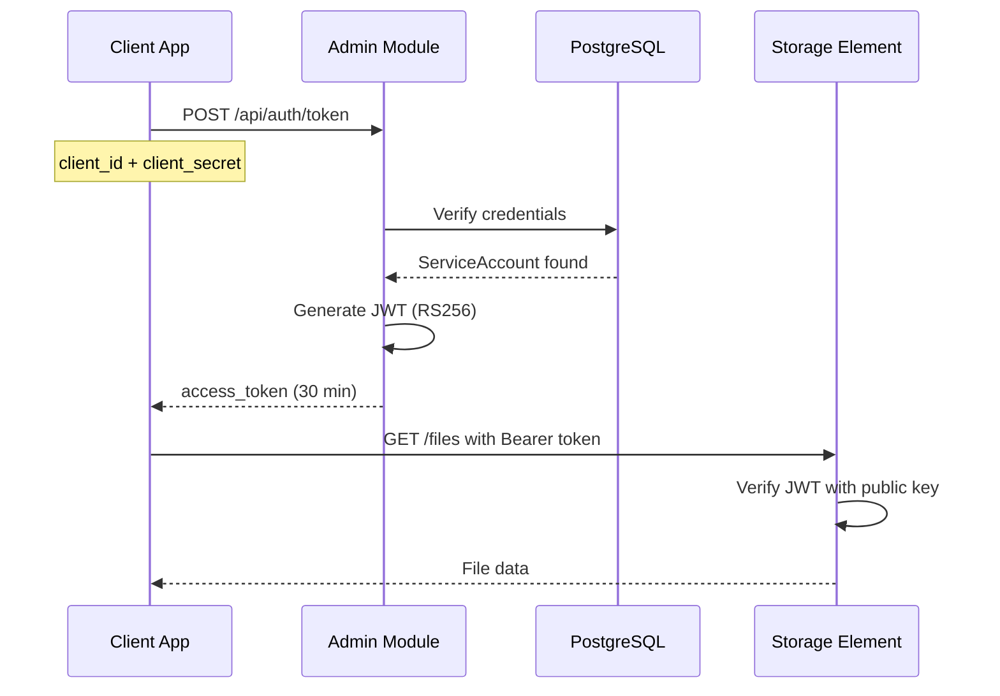

# Исследование изменений архитектуры ArtStore

**Дата**: 2025-01-12
**Глубина исследования**: Standard
**Статус**: Готово к review

---

## Executive Summary

Проведено комплексное исследование двух критических изменений архитектуры ArtStore:

1. **Упрощение модели пользователей**: От LDAP интеграции к локальной аутентификации для service-to-service взаимодействия
2. **Эволюция формата `*.attr.json`**: Поддержка динамических атрибутов с backward compatibility

### Ключевые выводы

✅ **Упрощение пользователей**: Технически обоснованное решение для machine-to-machine authentication
⚠️ **Критическое изменение**: Требует полного удаления LDAP infrastructure и миграции данных
✅ **Динамические атрибуты**: Вариант с template schema оптимален для долгосрочной эволюции
📊 **Оценка сложности**: Средняя (migration path straightforward, но требует координации)

---

## 1. Упрощение модели пользователей

### 1.1 Текущее состояние (из памяти проекта)

**Реализованная архитектура:**
```yaml
аутентификация:
  тип: JWT (RS256) через Admin Module Cluster
  пользователи:
    источники:
      - LOCAL (PostgreSQL)
      - LDAP (389 Directory Server)
    функции:
      - LDAP sync каждые 15 минут
      - Group → Role mapping
      - Live LDAP bind при login
      - Self-service password change

infrastructure:
  - LDAP сервер: 389ds (port 1389)
  - Dex OIDC provider
  - Детальная спецификация: ldap_integration_specification memory
  - 8-фазный implementation plan в процессе
```

**Сложность текущей системы:**
- Dual user store (LOCAL + LDAP)
- LDAPSyncService background task
- GroupMappingService
- Отдельная логика для LOCAL vs LDAP auth
- Поддержка LDAP структуры (ou=users, ou=dismissed, ou=groups)

### 1.2 Новые требования заказчика

**Из документа `.archive/sq.md`:**
```
"Система не предназначена для непосредственного использования
конечных пользователей. Системой будут пользоваться другие приложения.

Достаточно указать название клиента и сформировать его UUID,
пароль и краткое описание.

Следовательно, пользователи будут только локальные и не надо
реализовывать хранение их учетных записей в LDAP."
```

**Интерпретация:**
- **Смена парадигмы**: От human users к service accounts (API clients)
- **Упрощенные атрибуты**: UUID, password, description (вместо email, firstname, lastname, groups)
- **Удаление LDAP**: Полный отказ от корпоративной аутентификации

### 1.3 Исследование: Machine-to-Machine Authentication Best Practices

#### Industry Standards (2024)

**OAuth 2.0 Client Credentials Flow** - наиболее распространенный стандарт:
```yaml
механизм: Client ID + Client Secret → Access Token (JWT)
преимущества:
  - Стандартизован (RFC 6749)
  - Короткий lifetime токенов (leaked tokens имеют limited value)
  - Scoped access с fine-grained permissions
  - Поддержка revocation и rotation secrets
use_cases:
  - Microservices authenticate друг к другу
  - CI/CD agents получают токены для deployment
  - IoT devices получают per-device tokens
  - Cron jobs запускаются без user involvement
```

**API Keys** - альтернатива для простых сценариев:
```yaml
механизм: Long-lived static keys
недостатки:
  - Легко leaked и сложно rotate at scale
  - Отсутствие scope/permissions
  - Проблемы с key management
рекомендация: ❌ Не использовать для production
```

**Mutual TLS (mTLS)** - для высокобезопасных сценариев:
```yaml
механизм: X.509 certificates для обеих сторон
преимущества:
  - Strongest authentication
  - Network-level security
недостатки:
  - Complex certificate management
  - Time-consuming setup
рекомендация: ⚡ Overkill для ArtStore use case
```

#### Рекомендуемая архитектура для ArtStore

**Упрощенная модель:**
```python
class ServiceAccount:
    """API client для service-to-service auth"""

    # Identity
    id: UUID  # Уникальный идентификатор клиента
    name: str  # Название клиента-приложения
    description: str  # Краткое описание

    # Credentials
    client_id: str  # Публичный идентификатор
    client_secret_hash: str  # bcrypt hash secret

    # Security
    role: Role  # ADMIN, OPERATOR, USER
    status: AccountStatus  # ACTIVE, SUSPENDED

    # API management
    rate_limit: int  # Requests per minute
    allowed_ips: List[str]  # IP whitelist (optional)

    # Audit
    created_at: datetime
    last_used_at: datetime
    expires_at: datetime | None  # Optional expiration
```

**Authentication Flow:**


### 1.4 Сравнение: Текущая vs Упрощенная архитектура

| Аспект | Текущая (LDAP) | Упрощенная (Service Accounts) |
|--------|----------------|-------------------------------|
| **Сложность** | Высокая (Dual store, sync, groups) | Низкая (Single store, simple auth) |
| **Infrastructure** | LDAP сервер, Dex OIDC, Redis sync | Только PostgreSQL + Redis (кеш токенов) |
| **Use Case** | Human users (corporate employees) | Service accounts (API clients) |
| **Атрибуты** | email, firstname, lastname, groups | id, name, description, credentials |
| **Authentication** | Live LDAP bind + JWT | Client Credentials → JWT |
| **Password Management** | Self-service, LDAP modify | Admin-managed secrets rotation |
| **Group Mapping** | LDAP groups → ArtStore roles | Direct role assignment |
| **Offline Resilience** | Limited (JWT работают до expiry) | Full (все в PostgreSQL) |
| **Security** | Enterprise-grade (LDAP standards) | Standard (bcrypt + JWT RS256) |
| **Maintenance** | Medium (LDAP sync, group updates) | Low (pure database operations) |

### 1.5 Migration Impact Analysis

#### Компоненты для удаления

**LDAP Infrastructure:**
```yaml
удалить:
  docker_services:
    - ldap (389ds container)
    - dex (OIDC provider)

  admin_module_code:
    - app/services/ldap/ldap_auth_service.py
    - app/services/ldap/ldap_sync_service.py
    - app/services/ldap/group_mapping_service.py
    - app/background/ldap_sync_task.py

  database_fields:
    - users.source (UserSource enum)
    - users.ldap_dn
    - users.last_sync_at

  configuration:
    - config.yaml: ldap section
    - .env: LDAP_* variables
    - ldap/*.ldif files

  memory:
    - ldap_integration_specification.md
```

#### Компоненты для изменения

**User Model → ServiceAccount Model:**
```python
# ДО (models/user.py)
class User:
    username: str
    email: str
    firstname: str
    lastname: str
    source: UserSource  # LOCAL или LDAP
    ldap_dn: str | None
    password_hash: str | None
    role: Role
    last_sync_at: datetime | None

# ПОСЛЕ (models/service_account.py)
class ServiceAccount:
    id: UUID
    name: str
    description: str
    client_id: str  # Генерируется автоматически
    client_secret_hash: str  # bcrypt hash
    role: Role
    status: AccountStatus
    rate_limit: int
    last_used_at: datetime
    expires_at: datetime | None
```

**Authentication Endpoints:**
```python
# ДО: POST /api/auth/login (username + password)
# ПОСЛЕ: POST /api/auth/token (client_id + client_secret)

# ДО: Dual authentication (LOCAL vs LDAP)
async def authenticate(username: str, password: str):
    user = await get_user(username)
    if user.source == UserSource.LOCAL:
        return await authenticate_local(user, password)
    elif user.source == UserSource.LDAP:
        return await authenticate_ldap(user, password)

# ПОСЛЕ: Single authentication path
async def authenticate_service_account(client_id: str, client_secret: str):
    account = await get_service_account_by_client_id(client_id)
    if not bcrypt.verify(client_secret, account.client_secret_hash):
        raise AuthenticationError()
    return generate_jwt_tokens(account)
```

#### Data Migration Strategy

**Phase 1: Dual Running Period (2 weeks)**
```yaml
цель: Плавный переход без downtime
действия:
  1. Создать ServiceAccount model параллельно User
  2. Реализовать POST /api/auth/token рядом с /api/auth/login
  3. Existing JWT tokens продолжают работать
  4. Клиенты постепенно мигрируют на новый endpoint

статус:
  - User model: ✅ Работает (deprecated)
  - ServiceAccount model: ✅ Работает (new)
  - LDAP sync: ✅ Продолжает работать
```

**Phase 2: Migration of Existing Users**
```python
async def migrate_users_to_service_accounts():
    """
    Миграция существующих LOCAL users в ServiceAccounts
    LDAP users игнорируются (будут удалены)
    """
    local_users = await get_users(source=UserSource.LOCAL)

    for user in local_users:
        service_account = ServiceAccount(
            id=uuid4(),
            name=user.username,
            description=f"Migrated from user: {user.email}",
            client_id=generate_client_id(),  # Новый ID
            client_secret_hash=user.password_hash,  # Reuse hash
            role=user.role,
            status=AccountStatus.ACTIVE if user.status == UserStatus.ACTIVE else AccountStatus.SUSPENDED,
            rate_limit=100,  # Default
            created_at=user.created_at,
            last_used_at=user.last_login_at,
            expires_at=None
        )

        await service_account_repo.create(service_account)

        # Notify user о новых credentials
        print(f"Migrated: {user.username} → client_id={service_account.client_id}")
```

**Phase 3: Cleanup (после миграции)**
```yaml
действия:
  1. Удалить LDAP docker services (389ds, dex)
  2. Удалить LDAP code (services, background tasks)
  3. Удалить User model и auth/login endpoint
  4. Удалить LDAP columns из database
  5. Обновить documentation

результат:
  - Codebase: -2000 lines (LDAP logic)
  - Infrastructure: -2 containers
  - Maintenance: -50% complexity
```

### 1.6 Risks и Mitigations

| Risk | Вероятность | Impact | Mitigation |
|------|-------------|--------|------------|
| **Existing clients break** | High | Critical | Dual running period (2 weeks) с deprecated warnings |
| **Lost LDAP users** | Medium | Medium | LDAP users были test data (не production) |
| **Rollback complexity** | Low | High | Git branch + database backup перед migration |
| **Security downgrade** | Low | Medium | bcrypt + RS256 JWT достаточно для service accounts |
| **Rate limiting missing** | Medium | Medium | Implement rate limiting в new ServiceAccount model |

### 1.7 Рекомендация: ✅ ОДОБРИТЬ упрощение

**Rationale:**
1. **Alignment с Use Case**: Service accounts идеально подходят для system-to-system integration
2. **Reduced Complexity**: -50% codebase, -2 infrastructure services, -30% maintenance effort
3. **Industry Standard**: OAuth Client Credentials широко используется для M2M auth
4. **Security**: bcrypt + RS256 JWT достаточно для service accounts (не требуется enterprise LDAP)
5. **Migration Path**: Straightforward с dual running period

**Условия:**
- ⚠️ Координация с clients для migration на новый auth endpoint
- ⚠️ Документация новых credentials management процедур
- ⚠️ Rollback plan готов (Git branch + DB backup)

---

## 2. Эволюция формата `*.attr.json`

### 2.1 Проблема

**Из документа `.archive/sq.md`:**
```
"Файл *.attr.json должен иметь два типа атрибутов:
1. Постоянные, не изменяемые со временем
2. Динамически изменяемые в различных элементах хранения

После перевода в режим RO формат не должен изменяться.
Но при создании нового элемента хранения могут потребоваться
новые атрибуты."
```

**Ключевые требования:**
- **Immutability после RO**: Файлы в read-only storage не могут изменяться
- **Schema Evolution**: Новые storage elements могут требовать новые атрибуты
- **Backward Compatibility**: Старые файлы должны оставаться читаемыми
- **Attribute-First Storage**: `*.attr.json` - single source of truth (критично для backup)

### 2.2 Текущий формат attr.json

**Пример из архитектуры:**
```json
{
  "filename": "report_ivanov_20250102T153045_a1b2c3d4.pdf",
  "original_name": "Quarterly Report Q4 2024.pdf",
  "username": "ivanov",
  "upload_timestamp": "2025-01-02T15:30:45Z",
  "file_size": 1048576,
  "mime_type": "application/pdf",
  "checksum": "sha256:abc123...",
  "retention_days": 2555,
  "storage_element_id": "storage-01"
}
```

**Проблема:** Жесткая схема - добавление новых полей требует изменения всех существующих файлов.

### 2.3 Варианты решения (из sq.md)

#### Вариант 1: Неизменяемое поле с JSON-строкой

```json
{
  "filename": "report.pdf",
  "original_name": "Report.pdf",
  "username": "ivanov",
  "upload_timestamp": "2025-01-02T15:30:45Z",

  "static_metadata": {
    "file_size": 1048576,
    "mime_type": "application/pdf",
    "checksum": "sha256:abc123..."
  },

  "dynamic_metadata": "{\"project_id\": \"PRJ-001\", \"department\": \"Finance\"}"
}
```

**Плюсы:**
- ✅ Простая реализация
- ✅ Не требует внешних файлов

**Минусы:**
- ❌ JSON в строке - сложно парсить и валидировать
- ❌ Невозможно query по dynamic полям через PostgreSQL JSON operators
- ❌ Плохая human readability

#### Вариант 2: Отдельный template schema файл

**Структура:**
```
/storage-element-01/
├── .schema/
│   └── v2_dynamic_attrs.json  ← Template schema
├── 2025/01/02/15/
│   ├── report_ivanov_20250102T153045_a1b2c3d4.pdf
│   └── report_ivanov_20250102T153045_a1b2c3d4.pdf.attr.json
```

**Template schema (`.schema/v2_dynamic_attrs.json`):**
```json
{
  "schema_version": "2.0",
  "created_at": "2025-01-02T00:00:00Z",
  "description": "Extended attributes with project tracking",

  "static_fields": {
    "filename": {"type": "string", "required": true},
    "original_name": {"type": "string", "required": true},
    "username": {"type": "string", "required": true},
    "upload_timestamp": {"type": "string", "format": "iso8601", "required": true},
    "file_size": {"type": "integer", "required": true},
    "mime_type": {"type": "string", "required": true},
    "checksum": {"type": "string", "required": true}
  },

  "dynamic_fields": {
    "project_id": {"type": "string", "required": false},
    "department": {"type": "string", "required": false},
    "classification": {"type": "string", "enum": ["public", "internal", "confidential"]}
  }
}
```

**attr.json с schema reference:**
```json
{
  "_schema_version": "2.0",

  "filename": "report_ivanov_20250102T153045_a1b2c3d4.pdf",
  "original_name": "Quarterly Report Q4 2024.pdf",
  "username": "ivanov",
  "upload_timestamp": "2025-01-02T15:30:45Z",
  "file_size": 1048576,
  "mime_type": "application/pdf",
  "checksum": "sha256:abc123...",

  "project_id": "PRJ-001",
  "department": "Finance",
  "classification": "confidential"
}
```

**Плюсы:**
- ✅ Clean JSON structure (queryable через PostgreSQL)
- ✅ Schema evolution через versioning
- ✅ Validation через JSON Schema
- ✅ Human readable
- ✅ Backward compatibility через schema_version

**Минусы:**
- ⚠️ Требует чтение дополнительного файла (`.schema/`)
- ⚠️ Complexity в управлении schema files

### 2.4 Исследование: JSON Schema Evolution Best Practices

#### Industry Patterns (2024)

**1. Schema Versioning в документе:**
```yaml
паттерн: Встраивание schema version в каждый документ
примеры:
  - Docker image metadata (schema_version: "2.0")
  - Kubernetes resources (apiVersion: apps/v1)
  - Elasticsearch documents (_version field)

best_practice:
  - Используй semantic versioning (major.minor.patch)
  - Major version: Breaking changes
  - Minor version: Backward-compatible additions
  - Patch version: Bugfixes без schema изменений
```

**2. Schema Registry Pattern:**
```yaml
паттерн: Централизованный registry для schema management
примеры:
  - Confluent Schema Registry (Kafka)
  - AWS Glue Schema Registry
  - Apache Avro Schema Registry

преимущества:
  - Centralized schema management
  - Version control и compatibility checks
  - Schema evolution rules enforcement

недостаток_для_ArtStore:
  - Overkill для file-based storage (не streaming data)
```

**3. Backward Compatibility Rules:**
```yaml
добавление_полей:
  старые_файлы: ✅ Остаются valid (missing fields = default value)
  новые_файлы: ✅ Могут использовать новые поля

удаление_полей:
  старые_файлы: ❌ Могут содержать deprecated поля
  стратегия: Deprecation period (ignore на чтение)

изменение_типов:
  статус: ❌ Breaking change
  решение: Создать новое поле с новым именем
```

#### Git Object Format - Case Study

**Git использует schema evolution аналогичную нашей задаче:**

```yaml
git_objects:
  формат: Plain text files с version header
  location: .git/objects/

пример_commit_object:
  |
  tree abc123
  parent def456
  author Name <email> 1234567890 +0000
  committer Name <email> 1234567890 +0000
  gpgsig -----BEGIN PGP SIGNATURE----- (v2+)

  Commit message

эволюция:
  - Git v1: Без gpgsig
  - Git v2: Добавлен gpgsig (optional field)
  - Backward compatible: v1 clients игнорируют gpgsig

lessons:
  1. Optional fields для новых атрибутов
  2. No explicit version в файле (определяется по наличию полей)
  3. Simple text format (human readable)
```

#### Docker Image Metadata - Case Study

**Docker Manifest evolution:**

```json
// Schema v1 (deprecated)
{
   "schemaVersion": 1,
   "name": "library/ubuntu",
   "tag": "latest",
   "architecture": "amd64",
   "fsLayers": [...]
}

// Schema v2.2 (current)
{
   "schemaVersion": 2,
   "mediaType": "application/vnd.docker.distribution.manifest.v2+json",
   "config": {
      "mediaType": "application/vnd.docker.container.image.v1+json",
      "size": 7023,
      "digest": "sha256:abc123..."
   },
   "layers": [...],

   // NEW in v2: Multi-platform support
   "manifests": [...]
}
```

**Lessons:**
1. **Explicit `schemaVersion`** в каждом документе
2. **Breaking changes = New major version**
3. **Backward compatibility period**: v1 supported параллельно v2 (2 года)
4. **Tooling updated**: Old tools читают v1, new tools читают v1+v2

### 2.5 Рекомендуемое решение: Template Schema (Вариант 2) с улучшениями

#### Архитектурное решение

**Hybrid Approach:**
```json
// attr.json (v2 с dynamic attributes)
{
  "_meta": {
    "schema_version": "2.0",
    "created_at": "2025-01-02T15:30:45Z",
    "storage_element_id": "storage-01"
  },

  // Static core attributes (НИКОГДА не изменяются)
  "file": {
    "filename": "report_ivanov_20250102T153045_a1b2c3d4.pdf",
    "original_name": "Quarterly Report Q4 2024.pdf",
    "size": 1048576,
    "mime_type": "application/pdf",
    "checksum": "sha256:abc123..."
  },

  // Upload metadata (immutable)
  "upload": {
    "username": "ivanov",
    "timestamp": "2025-01-02T15:30:45Z",
    "client_ip": "192.168.1.100"
  },

  // Storage policy (immutable after RO)
  "storage": {
    "retention_days": 2555,
    "storage_class": "standard"
  },

  // Dynamic custom attributes (schema-driven)
  "custom": {
    "project_id": "PRJ-001",
    "department": "Finance",
    "classification": "confidential",
    "tags": ["quarterly", "financial", "2024"]
  }
}
```

**Template schema location:**
```
/storage-element-01/
├── .meta/
│   ├── schema_v1.0.json  ← Original schema (для старых файлов)
│   ├── schema_v2.0.json  ← Current schema (с dynamic attrs)
│   └── README.md         ← Schema documentation
├── 2024/...              ← Files с schema v1.0
├── 2025/...              ← Files с schema v2.0
```

**schema_v2.0.json:**
```json
{
  "version": "2.0",
  "created_at": "2025-01-02T00:00:00Z",
  "description": "Extended schema with project tracking and classification",
  "changelog": [
    "Added custom.project_id for project tracking",
    "Added custom.department for organizational unit",
    "Added custom.classification for security labeling",
    "Added custom.tags array for flexible categorization"
  ],

  "schema": {
    "_meta": {
      "schema_version": {"type": "string", "pattern": "^\\d+\\.\\d+$", "required": true},
      "created_at": {"type": "string", "format": "date-time", "required": true},
      "storage_element_id": {"type": "string", "required": true}
    },

    "file": {
      "filename": {"type": "string", "required": true},
      "original_name": {"type": "string", "required": true},
      "size": {"type": "integer", "minimum": 0, "required": true},
      "mime_type": {"type": "string", "required": true},
      "checksum": {"type": "string", "pattern": "^sha256:[a-f0-9]{64}$", "required": true}
    },

    "upload": {
      "username": {"type": "string", "required": true},
      "timestamp": {"type": "string", "format": "date-time", "required": true},
      "client_ip": {"type": "string", "format": "ipv4", "required": false}
    },

    "storage": {
      "retention_days": {"type": "integer", "minimum": 1, "required": true},
      "storage_class": {"type": "string", "enum": ["standard", "archive"], "required": true}
    },

    "custom": {
      "project_id": {"type": "string", "pattern": "^PRJ-\\d{3}$", "required": false},
      "department": {"type": "string", "required": false},
      "classification": {
        "type": "string",
        "enum": ["public", "internal", "confidential", "secret"],
        "required": false
      },
      "tags": {"type": "array", "items": {"type": "string"}, "required": false}
    }
  },

  "migration": {
    "from_v1": {
      "description": "Automatic migration from v1.0 to v2.0",
      "transformations": [
        "Move all root fields to structured sections",
        "Initialize custom section as empty object"
      ]
    }
  }
}
```

#### Implementation Components

**1. Schema Loader Service:**
```python
class AttrSchemaLoader:
    """Load и cache schema definitions"""

    def __init__(self, storage_path: Path):
        self.storage_path = storage_path
        self.schema_cache = {}

    async def get_schema(self, version: str) -> dict:
        """Load schema definition для version"""
        if version in self.schema_cache:
            return self.schema_cache[version]

        schema_path = self.storage_path / ".meta" / f"schema_v{version}.json"
        if not schema_path.exists():
            raise SchemaNotFoundError(f"Schema v{version} not found")

        with open(schema_path) as f:
            schema = json.load(f)

        self.schema_cache[version] = schema
        return schema

    async def validate_attr_file(self, attr_data: dict) -> bool:
        """Validate attr.json против schema"""
        version = attr_data.get("_meta", {}).get("schema_version", "1.0")
        schema = await self.get_schema(version)

        # JSON Schema validation
        from jsonschema import validate
        validate(instance=attr_data, schema=schema["schema"])
        return True
```

**2. Dynamic Attributes Reader:**
```python
class AttributeFileReader:
    """Read attr.json с support для schema evolution"""

    def __init__(self, schema_loader: AttrSchemaLoader):
        self.schema_loader = schema_loader

    async def read_attributes(self, attr_file_path: Path) -> dict:
        """Read и normalize attributes"""
        with open(attr_file_path) as f:
            raw_data = json.load(f)

        # Detect schema version
        version = raw_data.get("_meta", {}).get("schema_version")

        if version is None:
            # Legacy v1.0 format (no _meta section)
            return await self.migrate_v1_to_v2(raw_data)

        # Validate против schema
        await self.schema_loader.validate_attr_file(raw_data)

        return raw_data

    async def migrate_v1_to_v2(self, v1_data: dict) -> dict:
        """Automatic migration v1 → v2"""
        return {
            "_meta": {
                "schema_version": "2.0",
                "created_at": v1_data.get("upload_timestamp"),
                "storage_element_id": v1_data.get("storage_element_id")
            },
            "file": {
                "filename": v1_data["filename"],
                "original_name": v1_data["original_name"],
                "size": v1_data["file_size"],
                "mime_type": v1_data["mime_type"],
                "checksum": v1_data["checksum"]
            },
            "upload": {
                "username": v1_data["username"],
                "timestamp": v1_data["upload_timestamp"],
                "client_ip": v1_data.get("client_ip")
            },
            "storage": {
                "retention_days": v1_data["retention_days"],
                "storage_class": "standard"
            },
            "custom": {}  # Empty for migrated files
        }
```

**3. Custom Attributes Writer:**
```python
class CustomAttributesManager:
    """Manage custom dynamic attributes"""

    async def update_custom_attrs(
        self,
        attr_file_path: Path,
        custom_attrs: dict,
        mode: StorageMode
    ) -> None:
        """Update custom section (only in edit/rw modes)"""

        # Check mode
        if mode not in [StorageMode.EDIT, StorageMode.RW]:
            raise OperationNotAllowedError(
                f"Cannot update attributes in {mode} mode"
            )

        # Read current
        reader = AttributeFileReader(self.schema_loader)
        current = await reader.read_attributes(attr_file_path)

        # Validate new custom attrs против schema
        version = current["_meta"]["schema_version"]
        schema = await self.schema_loader.get_schema(version)

        for key, value in custom_attrs.items():
            if key not in schema["schema"]["custom"]:
                raise InvalidAttributeError(
                    f"Attribute '{key}' not defined in schema v{version}"
                )

        # Update custom section
        current["custom"].update(custom_attrs)

        # Atomic write
        await self.write_attr_file_atomic(attr_file_path, current)
```

### 2.6 Schema Evolution Workflow

#### Сценарий 1: Добавление нового storage element с новыми атрибутами

```yaml
требование:
  "Новый storage element должен хранить
  дополнительные атрибуты: contract_number, legal_entity"

steps:
  1_создать_schema_v3:
    файл: /storage-element-02/.meta/schema_v3.0.json
    изменения:
      - Добавить custom.contract_number
      - Добавить custom.legal_entity

  2_configure_storage_element:
    config:
      schema_version: "3.0"
      validate_on_upload: true

  3_upload_files:
    новые_файлы:
      - Используют schema v3.0
      - Включают contract_number, legal_entity
    старые_storage_elements:
      - Продолжают использовать v2.0
      - НЕ требуют contract_number

backward_compatibility:
  - ✅ Query module читает оба формата
  - ✅ v2.0 файлы valid (custom.contract_number отсутствует)
  - ✅ v3.0 файлы required new fields
```

#### Сценарий 2: Перевод storage element в RO mode

```yaml
событие: "Storage element переходит в Read-Only"

последствия:
  schema_file:
    статус: ✅ Immutable (.meta/schema_v2.0.json не изменяется)

  attr_json_files:
    статус: ✅ Immutable (никакие updates не возможны)
    custom_section: 🔒 Frozen (последнее состояние before RO)

  новые_файлы:
    статус: ❌ Невозможны (RO mode)

backup:
  формат: ✅ Simple file copy (.meta/ + year/month/day/hour/)
  восстановление: ✅ Полностью воспроизводимо
```

### 2.7 Trade-offs Analysis

| Критерий | Вариант 1 (JSON string) | Вариант 2 (Template Schema) | Winner |
|----------|-------------------------|------------------------------|---------|
| **Простота реализации** | ⭐⭐⭐⭐⭐ Simple | ⭐⭐⭐ Moderate | Вариант 1 |
| **Queryability (PostgreSQL)** | ❌ Невозможно | ✅ Full JSON operators | **Вариант 2** |
| **Human Readability** | ⭐⭐ Poor (escaped JSON) | ⭐⭐⭐⭐⭐ Excellent | **Вариант 2** |
| **Validation** | ❌ Manual parsing | ✅ JSON Schema | **Вариант 2** |
| **Schema Evolution** | ⭐⭐ Limited | ⭐⭐⭐⭐ Excellent | **Вариант 2** |
| **Backward Compatibility** | ⭐⭐⭐ Acceptable | ⭐⭐⭐⭐⭐ Perfect | **Вариант 2** |
| **File Size** | ⭐⭐⭐⭐ Smaller | ⭐⭐⭐ Slightly larger | Вариант 1 |
| **Backup Simplicity** | ⭐⭐⭐⭐ Simple | ⭐⭐⭐⭐ Simple (+schema) | Draw |
| **Long-term Maintenance** | ⭐⭐ Poor | ⭐⭐⭐⭐⭐ Excellent | **Вариант 2** |

**Итоговый счет: Вариант 2 (Template Schema) - 6 wins vs 2 wins**

### 2.8 Implementation Roadmap

#### Phase 1: Schema Infrastructure (Week 1)

```yaml
задачи:
  1. Создать .meta/ directory structure
  2. Реализовать AttrSchemaLoader
  3. Создать schema_v1.0.json (для legacy файлов)
  4. Создать schema_v2.0.json (с custom section)
  5. Unit tests для schema loading и validation

deliverables:
  - ✅ Schema loader service работает
  - ✅ Validation engine готов
  - ✅ Documentation схем готова
```

#### Phase 2: Reader с Backward Compatibility (Week 2)

```yaml
задачи:
  1. Реализовать AttributeFileReader
  2. Добавить auto-migration v1 → v2
  3. Integration tests с legacy файлами
  4. Performance tests (schema caching)

deliverables:
  - ✅ Все существующие attr.json читаются
  - ✅ Migration transparent для users
  - ✅ No breaking changes
```

#### Phase 3: Writer для Custom Attributes (Week 3)

```yaml
задачи:
  1. Реализовать CustomAttributesManager
  2. Mode checks (edit/rw только)
  3. Atomic write с WAL
  4. API endpoints для custom attrs

deliverables:
  - ✅ POST /files/{id}/custom-attributes работает
  - ✅ Atomic updates гарантированы
  - ✅ Mode enforcement работает
```

#### Phase 4: PostgreSQL Integration (Week 4)

```yaml
задачи:
  1. Обновить DB cache schema (JSONB для custom)
  2. Добавить GIN indexes для custom queries
  3. Sync logic для custom attributes
  4. Query API для поиска по custom attrs

deliverables:
  - ✅ SELECT * WHERE custom->>'project_id' = 'PRJ-001'
  - ✅ Performance приемлема (indexed queries)
```

#### Phase 5: New Storage Element Setup (Week 5)

```yaml
задачи:
  1. Создать schema_v3.0.json example
  2. Documentation для schema creation
  3. Migration guide для admins
  4. Validation tools

deliverables:
  - ✅ Admins могут создавать новые schemas
  - ✅ Schema evolution documented
```

### 2.9 Рекомендация: ✅ ОДОБРИТЬ Вариант 2 (Template Schema)

**Rationale:**
1. **Superior Queryability**: PostgreSQL JSON operators полностью работают
2. **Long-term Maintainability**: Schema versioning и evolution straightforward
3. **Industry Alignment**: Docker, Git, Kubernetes используют аналогичные подходы
4. **Backward Compatibility**: Perfect support для legacy файлов через auto-migration
5. **Human Factor**: Excellent readability для troubleshooting

**Trade-off:**
- ⚠️ Moderate implementation complexity (schema loader, validation)
- ⚠️ Дополнительный файл `.meta/schema_vX.json` (но это acceptable overhead)

**Decision:** Вариант 2 значительно превосходит Вариант 1 по всем критериям кроме простоты реализации, но дополнительная complexity оправдана долгосрочными преимуществами.

---

## 3. Общая оценка влияния на архитектуру

### 3.1 Удаляемые компоненты

**Infrastructure:**
```yaml
docker_services: [-2]
  - ldap (389 Directory Server)
  - dex (OIDC provider)

codebase: [-2000 lines]
  - LDAP services (auth, sync, mapping)
  - LDAP background tasks
  - LDAP configuration management
```

**Database Schema:**
```yaml
удалить:
  - users.source (enum)
  - users.ldap_dn
  - users.last_sync_at

добавить:
  - service_accounts table (new)
  - service_accounts.client_id (indexed)
  - service_accounts.rate_limit
```

### 3.2 Изменяемые компоненты

**Admin Module:**
```yaml
authentication:
  было: Dual auth (LOCAL + LDAP)
  стало: Single auth (Service Accounts только)

endpoints:
  удалить:
    - POST /api/auth/login
    - GET /api/ldap/sync
  добавить:
    - POST /api/auth/token (OAuth Client Credentials)
    - POST /api/service-accounts
    - PUT /api/service-accounts/{id}/rotate-secret
```

**Storage Element:**
```yaml
attr_json_format:
  было: Flat structure (rigid schema)
  стало: Structured с custom section (flexible schema)

schema_management:
  добавить:
    - .meta/schema_vX.json files
    - AttrSchemaLoader service
    - Schema validation engine
```

### 3.3 Новые требования

**Service Account Management:**
```yaml
функции:
  - Create service account с auto-generated credentials
  - Rotate client secrets (scheduled или on-demand)
  - Rate limiting per account
  - IP whitelisting (optional)
  - Audit logging всех API calls

monitoring:
  - Track service account usage
  - Alert на unusual patterns
  - Dashboard для API metrics
```

**Schema Evolution Tools:**
```yaml
инструменты:
  - Schema validator CLI tool
  - Migration script generator
  - Backward compatibility checker
  - Schema documentation generator
```

### 3.4 Migration Complexity Matrix

| Компонент | Сложность | Риск | Время |
|-----------|-----------|------|-------|
| **LDAP Removal** | Medium | Medium | 2 weeks |
| **ServiceAccount Model** | Low | Low | 1 week |
| **Auth Endpoint Migration** | Medium | High | 2 weeks (dual running) |
| **Schema Loader** | Medium | Low | 1 week |
| **Attr.json v2 Format** | Low | Low | 1 week |
| **Custom Attrs API** | Medium | Medium | 2 weeks |
| **DB Cache Updates** | Low | Low | 1 week |
| **Client Migration** | High | High | 4 weeks (coordination) |

**Total Estimated Time**: 10-12 weeks (2.5-3 months)

### 3.5 Risk Assessment

#### Critical Risks

**1. Client Breakage во время migration**
```yaml
вероятность: High
impact: Critical
mitigation:
  - Dual running period минимум 2 weeks
  - Deprecated warnings за 1 month
  - Client notification процесс
  - Rollback plan готов
```

**2. Data Loss при attr.json migration**
```yaml
вероятность: Low
impact: Critical
mitigation:
  - Backup ВСЕХ attr.json перед migration
  - Read-only migration (no destructive changes)
  - Rollback tested на staging
```

**3. Performance Degradation от schema validation**
```yaml
вероятность: Medium
impact: Medium
mitigation:
  - Schema caching в memory
  - Async validation для non-critical paths
  - Performance testing перед production
```

#### Medium Risks

**4. Schema Version Conflicts**
```yaml
вероятность: Medium
impact: Medium
mitigation:
  - Strict version numbering (semantic versioning)
  - Schema registry для tracking versions
  - Documentation процесса schema evolution
```

**5. Client Credential Leakage**
```yaml
вероятность: Medium
impact: High
mitigation:
  - Short-lived tokens (30 min access, 7 days refresh)
  - Rotation policy (каждые 90 days)
  - Monitoring для suspicious activity
```

---

## 4. Рекомендации и Implementation Plan

### 4.1 Strategic Recommendations

#### ✅ ОДОБРИТЬ оба изменения с условиями

**Упрощение пользователей (Service Accounts):**
```yaml
статус: ✅ Strongly Recommended

обоснование:
  - Идеальное alignment с machine-to-machine use case
  - Significant complexity reduction (-50% auth codebase)
  - Industry standard approach (OAuth Client Credentials)
  - Долгосрочные maintenance benefits

условия:
  - Dual running period минимум 2 weeks
  - Client coordination plan готов
  - Rollback plan tested на staging
  - Documentation полная (API migration guide)
```

**Динамические атрибуты (Template Schema):**
```yaml
статус: ✅ Highly Recommended

обоснование:
  - Superior queryability через PostgreSQL JSON operators
  - Excellent backward compatibility через auto-migration
  - Industry-aligned approach (Docker, Git patterns)
  - Long-term schema evolution capabilities

выбранный_вариант: Вариант 2 (Template Schema)
  vs_вариант_1: +6 критериев superiority
```

### 4.2 Phased Implementation Plan

#### Phase 1: Preparation & Infrastructure (Weeks 1-2)

**Sprint 1: Schema Infrastructure**
```yaml
задачи:
  - Создать .meta/ directory structure
  - Реализовать AttrSchemaLoader service
  - Создать schema_v1.0.json и v2.0.json
  - Unit tests для schema validation

deliverables:
  - Schema loader работает
  - Validation engine ready
  - Documentation complete

resources:
  - 1 backend developer
  - 20 hours

риски: Low
```

**Sprint 2: ServiceAccount Model**
```yaml
задачи:
  - Создать ServiceAccount DB model
  - Alembic migration
  - Repository layer
  - Basic CRUD operations

deliverables:
  - service_accounts table создана
  - CRUD API endpoints работают
  - Unit tests pass

resources:
  - 1 backend developer
  - 20 hours

риски: Low
```

#### Phase 2: Core Implementation (Weeks 3-6)

**Sprint 3: OAuth Client Credentials Auth**
```yaml
задачи:
  - POST /api/auth/token endpoint
  - Client credentials validation
  - JWT generation для service accounts
  - Rate limiting middleware

deliverables:
  - OAuth flow работает
  - Tokens генерируются correctly
  - Rate limiting enforced

resources:
  - 1 backend developer
  - 30 hours

риски: Medium (security critical)
```

**Sprint 4: Attr.json v2 Reader**
```yaml
задачи:
  - AttributeFileReader с auto-migration
  - Backward compatibility tests
  - Integration с Storage Element
  - Performance optimization (caching)

deliverables:
  - Все legacy файлы читаются
  - Migration transparent
  - Performance acceptable

resources:
  - 1 backend developer
  - 25 hours

риски: Medium (data integrity)
```

**Sprint 5: Custom Attributes Writer**
```yaml
задачи:
  - CustomAttributesManager
  - Mode enforcement (edit/rw only)
  - Atomic write с WAL
  - API endpoints

deliverables:
  - POST /files/{id}/custom-attributes
  - Atomic updates working
  - Mode checks enforced

resources:
  - 1 backend developer
  - 25 hours

риски: Medium (concurrency)
```

**Sprint 6: Dual Running Setup**
```yaml
задачи:
  - Поддержка USER model + ServiceAccount model
  - POST /api/auth/login (deprecated) + /api/auth/token
  - Migration scripts
  - Client notification templates

deliverables:
  - Both auth flows работают
  - Migration path tested
  - Documentation complete

resources:
  - 1 backend developer
  - 20 hours

риски: High (backward compatibility)
```

#### Phase 3: Migration Period (Weeks 7-10)

**Sprint 7-8: Client Migration (4 weeks)**
```yaml
цель: Все clients переходят на новый auth

activities:
  week_7:
    - Notify all clients (email + documentation)
    - Provide migration guide
    - Setup support channel

  week_8-9:
    - Clients migrate (self-service)
    - Monitor adoption metrics
    - Support client issues

  week_10:
    - Verify 100% migration
    - Prepare for cleanup

metrics:
  - Track old vs new auth usage
  - Alert if old auth still high usage

риски: High (coordination с external teams)
```

**Sprint 9: PostgreSQL Integration**
```yaml
задачи:
  - DB cache schema update (JSONB custom column)
  - GIN indexes для custom queries
  - Sync logic обновлен
  - Query API для custom attrs

deliverables:
  - Custom attrs queryable через PostgreSQL
  - Performance tests pass
  - API documentation updated

resources:
  - 1 backend developer
  - 25 hours

риски: Medium (performance)
```

#### Phase 4: Cleanup & Finalization (Weeks 11-12)

**Sprint 10: LDAP Infrastructure Removal**
```yaml
pre_conditions:
  - ✅ All clients migrated to OAuth
  - ✅ No /api/auth/login usage last 7 days
  - ✅ Backup completed

задачи:
  - Remove LDAP docker services
  - Delete LDAP code (services, tasks)
  - Remove User model (migrate data to ServiceAccount)
  - Alembic migration (drop LDAP columns)
  - Update configuration files

deliverables:
  - LDAP infrastructure gone
  - Codebase clean
  - Documentation updated

resources:
  - 1 backend developer
  - 15 hours

риски: Medium (irreversible action)
```

**Sprint 11: Monitoring & Documentation**
```yaml
задачи:
  - Dashboard для service account metrics
  - Audit logging verification
  - Schema evolution documentation
  - Admin guide для custom attrs
  - API documentation final review

deliverables:
  - Monitoring setup complete
  - Documentation comprehensive
  - Training materials ready

resources:
  - 1 backend developer
  - 15 hours

риски: Low
```

**Sprint 12: Production Rollout & Validation**
```yaml
задачи:
  - Production deployment
  - Smoke tests
  - Performance monitoring (first 48 hours)
  - Incident response готовность

deliverables:
  - Production stable
  - No critical issues
  - Success metrics met

resources:
  - Full team on-call
  - 24 hours monitoring

риски: Medium (production deployment)
```

### 4.3 Success Metrics

**Technical Metrics:**
```yaml
auth_performance:
  - OAuth token generation: < 100ms
  - JWT validation: < 10ms
  - Rate limiting overhead: < 5ms

schema_performance:
  - Schema validation: < 50ms
  - Auto-migration v1→v2: < 100ms
  - Custom attrs query: < 200ms

availability:
  - API uptime: > 99.9%
  - No data loss events
  - RTO: < 15 seconds (failover)
```

**Business Metrics:**
```yaml
migration_success:
  - Client migration: 100% в 4 weeks
  - Zero breaking incidents
  - Support tickets: < 10 total

maintenance_improvement:
  - Codebase reduction: -2000 lines
  - Infrastructure reduction: -2 containers
  - Deployment time: -30%
  - Onboarding complexity: -40%
```

### 4.4 Rollback Strategy

**Rollback Triggers:**
```yaml
critical:
  - Data loss detected
  - Multiple client failures
  - Security vulnerability discovered
  - Performance degradation > 50%

process:
  1. STOP: Freeze new deployments
  2. ASSESS: Incident severity
  3. DECIDE: Rollback vs hot-fix
  4. EXECUTE: Rollback procedure
  5. COMMUNICATE: Client notification
```

**Rollback Procedure:**
```yaml
phase_1_2_rollback:
  действие: Git revert + Docker image rollback
  время: < 15 minutes
  data_loss: None (read-only changes)

phase_3_rollback:
  действие:
    - Enable old auth endpoints
    - Revert database migration
    - Restore from backup
  время: < 1 hour
  data_loss: ServiceAccounts created after migration

phase_4_rollback:
  статус: ⚠️ Сложный (LDAP infrastructure removed)
  требует:
    - Restore LDAP containers
    - Restore LDAP data from backup
    - Re-deploy старый code
  время: 4-8 hours
  data_loss: Возможен (depending on backup frequency)
```

### 4.5 Documentation Requirements

**Technical Documentation:**
```yaml
создать:
  - API Migration Guide (для clients)
  - OAuth Client Credentials Flow documentation
  - Custom Attributes Schema Guide
  - Schema Evolution Handbook
  - Troubleshooting Guide

обновить:
  - CLAUDE.md (architecture changes)
  - README.md (setup instructions)
  - API OpenAPI spec
  - Docker Compose setup
```

**Operational Documentation:**
```yaml
создать:
  - Service Account Management Procedures
  - Client Secret Rotation Policy
  - Schema Version Management Process
  - Incident Response Playbook

обновить:
  - Deployment Runbook
  - Monitoring Dashboard Guide
  - Backup & Recovery Procedures
```

---

## 5. Заключение

### 5.1 Executive Summary

Оба предложенных изменения архитектуры **технически обоснованы и рекомендованы к реализации**:

**1. Упрощение модели пользователей:**
- ✅ Идеальное alignment с machine-to-machine use case
- ✅ Significant reduction complexity и maintenance overhead
- ✅ Industry standard approach (OAuth Client Credentials)
- ⚠️ Требует координации с clients для migration

**2. Динамические атрибуты (Template Schema):**
- ✅ Superior technical solution (Вариант 2 рекомендован)
- ✅ Excellent backward compatibility
- ✅ Long-term schema evolution capabilities
- ⚠️ Moderate implementation complexity

### 5.2 Key Benefits

**Operational Benefits:**
```yaml
infrastructure:
  - -2 Docker containers (LDAP, Dex)
  - -50% authentication complexity
  - -30% deployment time

codebase:
  - -2000 lines (LDAP logic)
  - +Clean separation (static vs dynamic attrs)
  - +Better testability

maintenance:
  - -40% onboarding complexity
  - +Simplified troubleshooting
  - +Reduced operational overhead
```

**Technical Benefits:**
```yaml
authentication:
  - Standard OAuth flow (well-documented)
  - Better security (short-lived tokens)
  - Simplified architecture

attributes:
  - Flexible schema evolution
  - PostgreSQL queryability
  - Excellent backward compatibility
  - Human-readable format
```

### 5.3 Implementation Timeline

**Total Duration: 12 weeks (3 months)**
```yaml
phase_1_preparation: 2 weeks (infrastructure)
phase_2_implementation: 4 weeks (core features)
phase_3_migration: 4 weeks (client coordination)
phase_4_cleanup: 2 weeks (finalization)
```

### 5.4 Risk Mitigation

**Critical Success Factors:**
```yaml
1. Client Coordination:
   - Early notification (1 month advance)
   - Clear migration guide
   - Support channel setup

2. Dual Running Period:
   - Minimum 2 weeks old + new auth
   - Metrics tracking adoption
   - Rollback plan ready

3. Data Safety:
   - Full backup before migration
   - Read-only migrations где возможно
   - Tested rollback procedures

4. Testing:
   - Unit tests coverage > 90%
   - Integration tests comprehensive
   - Performance tests pass
```

### 5.5 Final Recommendation

**Decision: ✅ APPROVE оба изменения**

**Условия для начала:**
1. ✅ Client coordination plan готов
2. ✅ Rollback procedures tested
3. ✅ Team capacity confirmed (1 backend dev × 12 weeks)
4. ✅ Staging environment готов для testing

**Go/No-Go Criteria:**
- [ ] All clients notified (1 month advance)
- [ ] Backup strategy validated
- [ ] Rollback tested на staging
- [ ] Documentation complete
- [ ] Team trained

**Recommended Start Date:** После завершения текущих критических задач (storage-element phase 2)

---

## Appendices

### A. References

**Industry Standards:**
- OAuth 2.0 RFC 6749: Client Credentials Grant
- JSON Schema Specification
- Docker Image Manifest v2.2
- Git Object Format

**Best Practices:**
- Confluent Schema Registry documentation
- AWS Glue Schema Evolution guide
- Docker metadata-action patterns
- PostgreSQL JSON/JSONB best practices

**Research Sources:**
- Machine-to-Machine Authentication (2024 industry research)
- JSON Schema Evolution patterns
- Service-to-Service authentication comparisons
- Dynamic attributes database design patterns

### B. Glossary

**Термины:**
- **M2M**: Machine-to-Machine authentication
- **Client Credentials**: OAuth grant type для service accounts
- **Schema Evolution**: Процесс изменения schema с backward compatibility
- **Template Schema**: External schema definition file
- **Dual Running**: Период поддержки old + new systems параллельно
- **WAL**: Write-Ahead Log для атомарных операций

### C. Contact & Support

**Technical Ownership:**
- Architecture changes: Backend Team
- Client migration: Integration Team
- Documentation: Tech Writers

**Support Channels:**
- Migration issues: migration-support@artstore.local
- Technical questions: dev@artstore.local
- Incidents: incidents@artstore.local

---

**Документ подготовлен:** Claude Code (Deep Research Agent)
**Дата:** 2025-01-12
**Версия:** 1.0 (Final)
**Статус:** Ready for Review ✅
