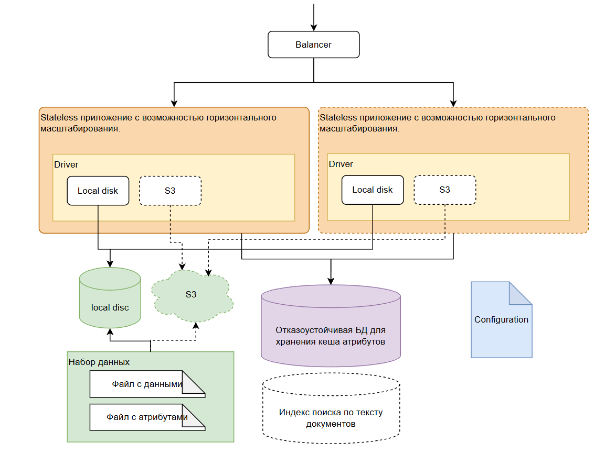

# Элемент хранения



Элемент хранения - это приложение, реализующее хранение файлов. Для доступа к данным, реализует REST API.

Состоит из:

- Управляющего приложения. Умеет горизонтально масштабироваться.
- Физического хранилища файлов на диске или в S3.
- Кеш аттрибутов файлов. База данных.
- Конфигурационный файл приложения.

## Управляющее приложения

Приложение должно реализовывать следующие функции:

- **Аутентификация и авторизация**: Все запросы должны быть аутентифицированы с помощью **JWT-токена (RS256)**.
  - Валидация токена (проверка подписи и срока действия) происходит **локально** с использованием публичного ключа, полученного от `admin-module`.
  - Это исключает необходимость сетевых запросов к `admin-module` для проверки каждого токена.
- **Безопасность файлов**: Файлы хранятся в незашифрованном виде для обеспечения совместимости и простоты backup процедур.
- **Управление настройками хранилища** (доступно только пользователям с правами администратора).
- Создание/пересоздание кеша аттрибутов файлов в базе данных (только пользователи входящие в группу admins).
- Web страница с информацией по приложению.
  - Содержимое конфигурационного файла. Значения логинов и паролей выводятся в скрытом формате.
  - Предоставить информацию о версии приложения.
  - Данные по хранилищу на диске: установленный в конфигурации лимит, процент заполнения, количество файлов.
- Health checks (не закрыто авторизацией и аутентификацией).
  - Liveness probe. Возвращает HTTP 200 OK, если сервис работает.
  - Readiness probe. Возвращает HTTP 200 OK, если сервис работает и есть подключение к базе данных.

### REST API

#### Общее описание

- Добавление файлов в хранилище.
- Удаление файлов из хранилища.
- Изменение атрибутов файла.
- Поиск файлов, в том числе по атрибутам.

#### Методы

- **GET /**: Корневой эндпоинт с информацией о сервисе.
- **GET /health/live**: Liveness probe.
- **GET /health/ready**: Readiness probe.
- **GET /health/status**: Подробная информация о состоянии сервиса.
- **GET /admin/config**: Получает текущую конфигурацию приложения.
- **GET /admin/info**: Получает системную информацию приложения.
- **POST /admin/cache/rebuild**: Пересоздает кеш метаданных файлов.
- **POST /admin/cache/verify**: Проверяет целостность кеша метаданных.
- **PUT /admin/mode**: Изменяет режим работы приложения.
### Файловые операции с оптимизацией
- **POST /api/v1/files/upload**: Загружает файл с **streaming upload**, compression on-the-fly и Saga транзакциями.
- **GET /api/v1/files/search**: Поиск файлов по метаданным через **PostgreSQL Full-Text Search с GIN индексами**.
- **GET /api/v1/files/{file_id}**: Получает информацию о файле с **metadata caching**.
- **DELETE /api/v1/files/{file_id}**: Удаляет файл с компенсирующими операциями и **async cleanup**.
- **GET /api/v1/files/{file_id}/download**: Скачивает файл с **resumable downloads**.
- **PUT /api/v1/files/{file_id}/metadata**: Обновляет метаданные с Vector Clock и **real-time database cache sync**.

### Производительность и кеширование
- **GET /api/v1/cache/warm**: Предварительная загрузка популярных файлов в cache.
- **POST /api/v1/cache/invalidate**: Инвалидация кеша для определенных файлов.
- **GET /api/v1/metrics/performance**: Метрики производительности и статистика доступа.

### Координация и транзакции
- **GET /api/v1/coordination/status**: Получает статус системы координации.
- **GET /api/v1/coordination/master**: Получает информацию о текущем мастере.
- **POST /api/v1/coordination/master/release**: Принудительно освобождает роль мастера.
- **GET /api/v1/transactions/wal**: Получает статус Write-Ahead Log.
- **POST /api/v1/transactions/reconcile**: Запускает процедуру reconciliation.
- **GET /api/v1/transactions/vector-clock**: Получает текущий Vector Clock.
- **POST /api/v1/transactions/saga/{saga_id}/participate**: Участие в Saga транзакции.

### Управление безопасностью и аудитом
- **POST /api/v1/security/audit/log**: Принудительная запись события аудита с цифровой подписью.
- **GET /api/v1/security/audit/verify**: Проверка целостности логов аудита через цифровые подписи.
- **POST /api/v1/security/access/validate**: Валидация прав доступа пользователя к конкретному ресурсу.
- **GET /api/v1/security/compliance/report**: Генерация отчета соответствия требованиям безопасности.

### Advanced Monitoring и Observability

#### OpenTelemetry Integration
- **File Operation Tracing**: Детальное отслеживание всех операций с файлами от запроса до сохранения
- **Storage Performance Monitoring**: Метрики производительности дисковой подсистемы и S3 операций
- **Database Query Tracing**: Профилирование всех запросов к кешу метаданных
- **Distributed Context**: Передача trace информации между storage-element и другими модулями

#### Custom Business Metrics
- **File Upload Latency**: Время загрузки файлов сегментированное по размерам (< 1MB, 1-10MB, 10-100MB, > 100MB)
- **Storage Utilization**: Использование дискового пространства с прогнозами заполнения
- **Cache Hit Ratios**: Эффективность кеширования метаданных в PostgreSQL
- **Mode Transition Metrics**: Статистика переходов между режимами (edit → rw → ro → ar)

#### Third-party Analytics Integration
- **Storage Metrics Export**: Экспорт storage utilization metrics в Prometheus для external analytics
- **Performance Data**: Structured metrics для capacity planning через external systems
- **Trace Data Export**: OpenTelemetry file operations traces для external APM platforms


## База данных

Для каждого элемента хранения в базе данных должны создаваться отдельные таблицы для хранения параметров и кеша метаданных файлов.

В одной базе данных могут находиться таблицы других элементов хранения. Поэтому необходимо предусмотреть уникальность имен таблиц.

## Физическое хранилище

В качестве физического хранилища может использовать следующие варианты хранения:

- Локальная файловая система.
- S3 хранилище.

Приложение в один момент может работать только с одним типом хранилища. Тип хранилища задается в конфигурации системы.

Размер хранилища задаётся при его инициализации и не может быть увеличен в процессе эксплуатации. При запуске приложения необходимо проверять, что текущий размер хранилища не меньше требуемого в конфигурации.

При добавлении нового файла, всегда проверять есть ли место в хранилище для размещения этого файла. Если места для размещения не хватает, формировать ошибку: "недостаточно места в хранилище".

В случае S3 хранилища, в бакете создается отдельная папка для данных приложения. Название бакета задается в конфигурации.

## Цифровая подпись файла

Если файл имеет цифровую подпись в виде отдельного файла, то файл с подписью кладется рядом с основным файлом. Файл цифровой подписи должен иметь такое же имя, как подписываемый файл, но с другим расширением. Ссылка на файл цифровой подписи должна быть в файле с метаданными подписываемого файла.

## Метаданные файла

Метаданные сохраняемого файла хранятся в json файле, создаваемом рядом с основным файлом. Имя файла с метаданными соответствует имени основного файла, но с расширением `attr.json`.

Поскольку поиск метанных, находящихся в файловой системе медленный, необходимо хранить копию (кеш) метаданных в базе данных.

В API необходимо предусмотреть команды для работы с кеш:

- создание/пересоздание кеш
- проверка кеш

При изменении или создании метаданных файла используется **протокол консистентности**:

1. **Write-Ahead Log (WAL)**: Запись намерения об операции в лог транзакций
2. **Файл атрибутов** (`*.attr.json`): Запись в файл как источник истины
3. **Vector Clock Update**: Обновление локального векторного времени
4. **Database Cache**: Обновление кеша в базе данных
5. **Transaction Commit**: Подтверждение завершения операции в WAL

При запросе метаданных файла:
- Проверка актуальности кеша по Vector Clock
- Если кеш актуален - использование данных из кеша
- Если кеш устарел - чтение из файла атрибутов и обновление кеша
- Автоматическая reconciliation при обнаружении расхождений

Метаданные содержат:

- Уникальный идентификатор файла.
- Имя файла
- Размер файла
- Время создания файла
- Пользователя, создавшего файл. Его логин, ФИО и UID.
- Краткая информация о содержимом файла (Пользовательское описание). Может быть пустым.
- Версия документа.

## Структура файловой системы хранения файлов

Для хранения файлов создаются отдельные директории: `/год/месяц/день/час/` файлы.

Имя сохраняемого файла состоит из имени файла и его версии.

## Режимы работы приложения

Режимы работы задаются в конфигурации или при помощи API администратором.

Текущее состояние модуля хранится в базе данных. Если при старте модуля его конфигурация не соответствует состоянию в базе данных, берется значение из базы данны, в логах выдается WARNING о несоответствии конфигурационных параметров текущему состоянию.

Предусмотрены следующие режимы:

- `edit` - в этом режиме можно искать, добавлять, удалять, редактировать файлы в хранилище.
- `rw` - аналогичный режиму `edit`, кроме удаления файлов. Удалять файлы из такого хранилища может только администратор.
- `ro` - в этом режиме доступен только режим поиска и скачивания файлов.
- `ar` - аналогичен режиму `ro`. Но файлы и файлы с метаданными локально недоступны. Доступны только данные из кеш в базе данных. Поэтому можно получить только информацию о файлах и их метаданных. При попытке скачать файл, должна выдаваться ошибка: "Файл перенесен в долговременное хранилище, обратитесь к администратору".

Изменение режима работы через API возможно только в следующей последовательности:

- `edit` - режим менять нельзя.
- `rw` -> `ro`
- `ro` -> `ar`

Переходить из режима `ar` в другие режимы можно только установив соответствующий режим в файле конфигурации и перезагрузив приложение.

## Отказоустойчивость приложения

Приложение может работать без организации кластера (горизонтального масштабирования). Но в случае продуктивной среды рекомендуется запускать минимум два экземпляра приложения.

### Кластерная архитектура

Для обеспечения высокой доступности storage-element развертывается в кластерной конфигурации:

#### Master Election через Redis Sentinel
- **Distributed Leader Election**: Выбор мастера через Redis Sentinel кластер для режимов `edit` и `rw`
- **Automatic Failover**: Переключение на standby узел за < 30 секунд при недоступности мастера
- **Split-Brain Protection**: Кворумные решения через Sentinel для предотвращения конфликтов
- **Health Monitoring**: Непрерывный мониторинг состояния узлов через Redis heartbeat

#### Load Balancer Cluster
- **Active-Active HAProxy/Nginx**: Кластер балансировщиков с keepalived для исключения SPOF
- **Health Checks**: Автоматическое исключение недоступных узлов из балансировки
- **Session Affinity**: Sticky sessions для операций с состоянием (при необходимости)
- **Circuit Breaker**: Автоматическое отключение недоступных backend узлов

#### Stateless Design
- **Shared Storage**: Общий доступ к файловому хранилищу (NFS/S3) для всех узлов кластера
- **Database Clustering**: PostgreSQL кластер для кеша метаданных с автоматическим failover

## Конфигурация приложения

Для конфигурации приложения необходимо создать конфигурационный файл в формате yaml.

В файле конфигурации необходимо указать следующие параметры:

- Режим работы приложения (`edit`, `rw`, `ro`, `ar`)
- Параметры подключения к базе данных.
- Необходимо ли при запуске приложения проверять и пересоздавать кеш.
- Включение режима отладки.
- Параметры логирования.
- Указание режима аутентификации и их параметры.
- Параметры для конечной точки сбора метрик.
- Пути к liveness и readiness пробам.

Параметры приложения могут быть заданы при помощи переменных среды окружения.
Переменные среды окружения имеют приоритет перед параметрами в конфигурационном файле.

Пример конфигурационного файла:

```yaml
# Конфигурация элемента хранения ArtStore
app:
  name: "storage-element"
  version: "1.0.0"
  debug: true

  # Режим работы приложения: edit, rw, ro, ar
  mode: "rw"

  # Проверять и пересоздавать кеш при запуске
  rebuild_cache_on_startup: false

# Настройки веб-сервера
server:
  host: "0.0.0.0"
  port: 8010
  workers: 1

# Настройки базы данных
database:
  # Подключение к PostgreSQL
  host: "localhost"
  port: 5432
  username: "artstore"
  password: "password"
  database: "artstore"

  # Настройки пула соединений
  pool_size: 10
  max_overflow: 20
  pool_timeout: 30
  pool_recycle: 3600

  # Префикс для имен таблиц данного экземпляра
  table_prefix: "storage_elem_01"

# Настройки Redis Sentinel для координации и HA
redis:
  # Sentinel cluster endpoints
  sentinel_hosts:
    - host: "redis-sentinel-1"
      port: 26379
    - host: "redis-sentinel-2"
      port: 26379
    - host: "redis-sentinel-3"
      port: 26379
  master_name: "artstore-master"
  db: 0
  password: null

  # Настройки для выбора мастера
  master_election:
    key_prefix: "storage_master"
    ttl: 30 # Время жизни ключа мастера в секундах
    check_interval: 10 # Интервал проверки мастера

  # Circuit breaker для Redis failover
  circuit_breaker:
    failure_threshold: 5
    recovery_timeout: 60
    half_open_max_calls: 3

# Настройки хранилища
storage:
  # Тип хранилища: local, s3
  type: "local"
  max_size: 1Gb

  # Настройки локального хранилища
  local:
    base_path: "./.data/storage"

  # Настройки S3 (используются если type == "s3")
  s3:
    endpoint_url: "http://localhost:9000" # URL для MinIO
    access_key_id: "minioadmin"
    secret_access_key: "minioadmin"
    bucket_name: "artstore-files"
    region: "us-east-1"    
    # Папка в бакете для данных этого экземпляра приложения
    app_folder: "storage_element_01"

# Настройки аутентификации
auth:
  # Режим аутентификации: local, local+LDAP, LDAP, OAuth2, local+OAuth2
  # local - только локальные пользователи из admin_module
  # LDAP - только пользователи LDAP серверов.
  # local+LDAP - смешанный режим
  # OAuth2 - только пользователи из этого провайдера
  # local+OAuth2

  mode: "local"

  # Настройки для локальной валидации JWT (RS256)
  jwt:
    # Путь или URL для получения публичного ключа от admin-module
    public_key_path: "/path/to/public_key.pem"
    # Алгоритм подписи
    algorithm: "RS256"

# Настройки логирования
logging:
  level: "INFO" # DEBUG, INFO, WARNING, ERROR, CRITICAL
  format: "json" # json, text

  # Назначения для логов
  handlers:
    console:
      enabled: true
    file:
      enabled: false
      path: "/app/logs/storage-element.log"
      max_bytes: 104857600 # 100MB
      backup_count: 5
    network:
      enabled: false
      protocol: "syslog" # syslog, http
      host: "log-server"
      port: 514

# Настройки метрик Prometheus
metrics:
  enabled: true
  path: "/metrics"

# Настройки health checks
health:
  liveness_path: "/health/live"
  readiness_path: "/health/ready"

# Административный интерфейс
admin:
  enabled: true
  path: "/admin"
  # Доступ только для пользователей группы admins
```

## Мониторинг

Приложение должно отдать метрики мониторинга в формате Prometheus.
Метрики должны содержать следующие данные:

- `up` = 1 Если приложение работает.
- `ready` = 1 Если приложение работает и готово принимать запросы по сети и есть подключение к базе данных
- Информацию о сетевых запросах к API приложения.
- Состояние подключения к базе данных. Если используется connection pool, его состояние.

## Логирование

- Поддержка JSON и текстового формата
- Настраиваемые уровни логирования
- Ротация файлов логов
- Структурированное логирование операций

В конфигурации приложения можно указывать:

- куда сохранять логи приложения:
  - stdout и stderr (по умолчанию).
  - файлы на диске.
  - по сети (смотри какие протоколы для приема логов могут использовать приложения типа flunetbit или vector)
  - логи можно одновременно сохранять как на stdout и stderr, так и в файл.
- уровень важности логов.
- формат логов: txt или json. По умолчанию json.

## Технологии

### Основной стек
- **Python >=3.12** с uvloop для максимальной производительности
- **FastAPI** с async/await для конкурентной обработки
- **SQLAlchemy** (async mode) с connection pooling
- **PostgreSQL >=15** с query optimization

### Поиск и индексирование
- **ElasticSearch 8.x** для быстрого поиска метаданных
- **Apache Kafka** для асинхронной индексации файлов
- **Apache Tika** для full-text поиска внутри документов

### Кеширование и производительность
- **Redis Cluster** для distributed caching
- **Local Cache** (in-memory) для hot data
- **CDN Integration** (CloudFlare/AWS CloudFront)
- **HTTP/2** persistent connections

### Инфраструктура
- **HAProxy/Nginx** load balancer cluster
- **Docker** с multi-stage builds
- **Prometheus/Grafana** для мониторинга производительности

### Оптимизация
- **Brotli/GZIP** compression
- **Connection pooling** для всех внешних сервисов
- **Async I/O** для файловых операций
- **Background tasks** для heavy operations

## Запуск и отладка приложений

Запуск и отладка приложений происходит в Docker контейнере.

Диапазон портов для storage_element: 8010-1019

## Разработка

Для разработки рекомендуется:

- Использовать виртуальное Python в Docker контейнере
- Запускать инфраструктуру через docker-compose

## Дополнительные требования

- Каждый storage_element должен иметь обязательный параметр "срок хранения документов" (retention_period), который задается при создании элемента хранения
- Срок хранения может быть указан в годах или днях
- Изменение срока хранения может выполнять только администратор системы
- В административном UI должно отображаться оставшееся время до окончания срока хранения:
  - Если до окончания срока хранения больше года - отображать в годах
  - Если до окончания срока хранения меньше года - отображать в днях
- Система должна предупреждать администратора о приближении окончания срока хранения. В конфигурации storage_element должен быть параметр, определяющий, за сколько дней, месяцев или лет выдавать такое предупреждение.
- По истечении срока хранения документов в элементе, элемент может быть помечен для удаления или архивирования